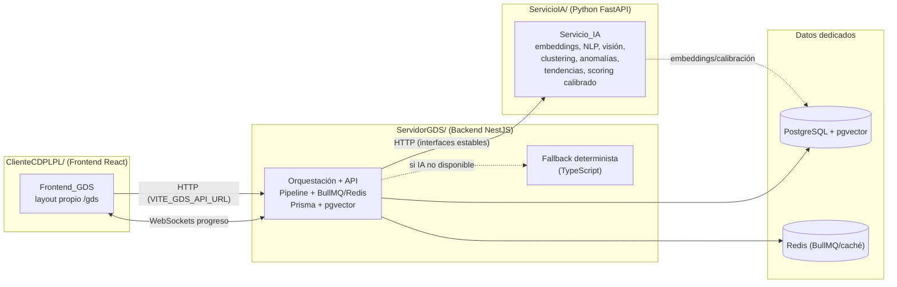
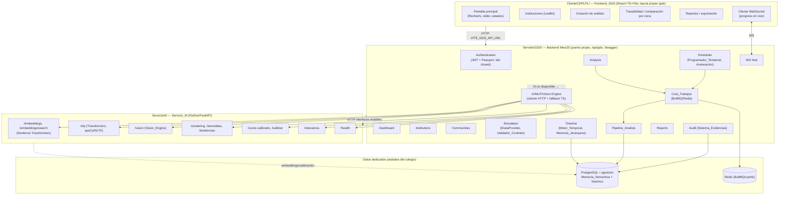
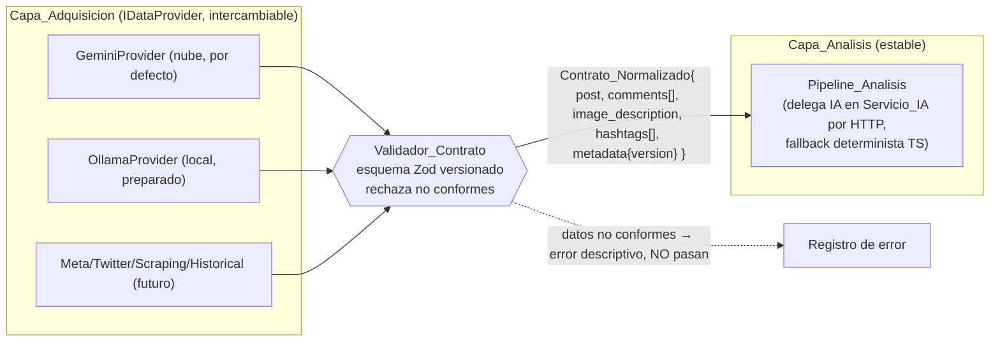
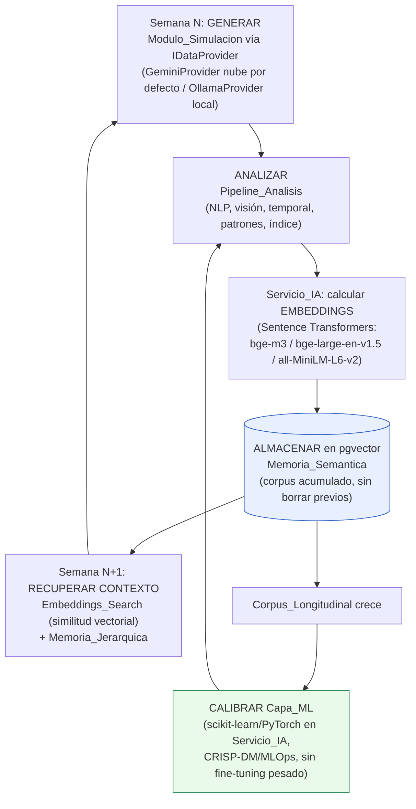
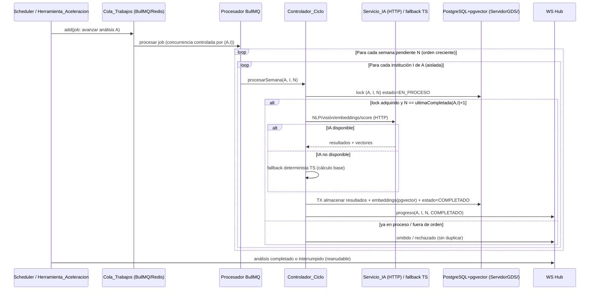
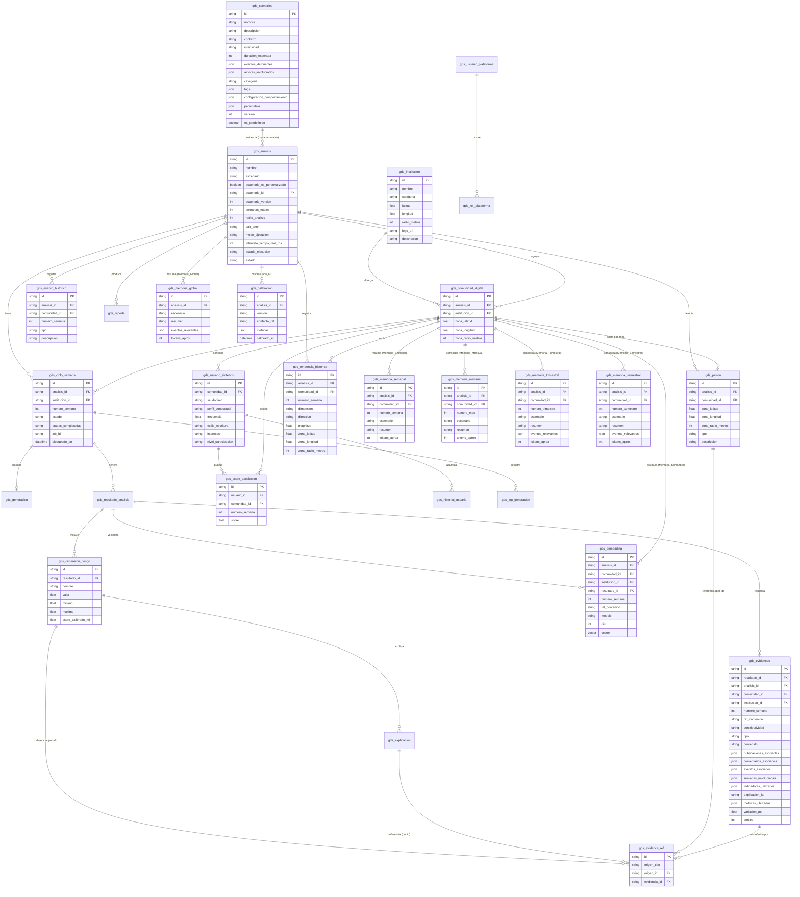

# Design Document

## Overview

Este documento describe el diseño técnico de la **Plataforma_GDS** (Gemelo Digital Social de Comunidades Educativas): una sección independiente que **GENERA** comunidades educativas digitales sintéticas mediante IA, las hace **EVOLUCIONAR** durante ~24 `Semana_Simulada` (~6 meses) y **APRENDE** del historial longitudinal acumulado para **detectar, analizar y explicar tendencias digitales colectivas** de riesgo emocional. La salida es siempre **colectiva, probabilística y explicativa** — nunca diagnóstica ni individual.

### Arquitectura de despliegue: tres componentes

El sistema se compone de **tres entregables (deployables) reales y simultáneos**, cada uno en su propia carpeta de primer nivel del repositorio:

1. **`ClienteCDPLPL/` — Frontend (`Frontend_GDS`).** Aplicación **React + TypeScript + Vite + TailwindCSS + Shadcn/UI + TanStack Query + React Router + Zustand + Recharts + Framer Motion + Leaflet + React Hook Form + Zod + Axios**. Vive como feature `gds` con **layout propio** (estética enterprise tipo AWS/Azure) bajo el prefijo de ruta `/gds`, accesible desde el dashboard del colegio pero **sin relación** con el módulo IREC. Consume el backend NestJS por **HTTP** (URL base configurable, p. ej. `VITE_GDS_API_URL`) y recibe el **progreso en vivo por WebSockets**.

2. **`ServidorGDS/` — Backend de orquestación y API (`ServidorGDS`).** Servicio **NestJS + TypeScript + Node.js + Prisma ORM + Swagger/OpenAPI + BullMQ + Redis + JWT + Passport + class-validator + class-transformer**, independiente y autónomo, con arquitectura **Monolito Modular + Clean Architecture + DDD parcial + Event-Driven interno**. Orquesta `procesarSemana`, el `Pipeline_Analisis`, la cola **BullMQ sobre Redis**, la persistencia en su **base de datos PostgreSQL + pgvector dedicada** y la API pública documentada con Swagger. **Consume** el `Servicio_IA` por **HTTP** a través de las interfaces estables (`Servicio_NLP`, `Servicio_Vision`, `Capa_ML`, `Filtro_Relevancia`), con **fallback determinista en TypeScript** y degradación segura cuando el `Servicio_IA` no está disponible (R35).

3. **`ServicioIA/` — Servicio de IA en Python (`Servicio_IA`).** Servicio **FastAPI** que implementa el **cerebro analítico real**: embeddings (Sentence Transformers: `BAAI/bge-m3`, `BAAI/bge-large-en-v1.5`, `all-MiniLM-L6-v2`), NLP (sentiment, emotion, topic modeling, NER, semantic similarity, classification, clustering, embeddings search), `Vision_Engine` (texto en v1, preparado para LLaVA/Qwen2-VL/Florence-2/BLIP-2/EasyOCR), clustering/anomalías/tendencias y scoring calibrado del `Indice_Riesgo`, con librerías **Transformers, Sentence Transformers, spaCy, NLTK, scikit-learn, PyTorch, NumPy, Pandas**. Es **parte del sistema actual, no una opción futura**: es el núcleo de investigación. Expone un **contrato HTTP** que el `ServidorGDS` consume.



> **Reubicación del trabajo previo (Express/TS heurístico):** las implementaciones TypeScript base/heurísticas de `Servicio_NLP`, `Servicio_Vision`, `Capa_ML` y `Filtro_Relevancia` construidas previamente (antes en Express/TS) se **reposicionan como el fallback determinista** del `ServidorGDS`: sirven para pruebas y para **degradación segura** cuando el `Servicio_IA` no está disponible, **no** como el cerebro analítico principal (D4, D7, R35.3).

### Objetivo principal del proyecto

El aporte principal de IA de la Plataforma_GDS **NO es el análisis de sentimiento**. El objetivo central es:

> **La generación de ecosistemas digitales sintéticos evolutivos y el análisis explicativo longitudinal de tendencias digitales colectivas mediante inteligencia artificial, permitiendo validar modelos de detección de riesgo emocional aun cuando no existan fuentes masivas de datos reales disponibles.**

El valor diferencial está en **simular ecosistemas sociales que evolucionan en el tiempo**, en **aprender** acumulando una **memoria semántica vectorial** (`Memoria_Semantica` en `pgvector`) y en **explicar causalmente** cómo y por qué cambian las tendencias colectivas. El diseño prioriza, en este orden, seis cualidades transversales:

1. **Evolución temporal** — cambio semana a semana, no fotografías estáticas.
2. **Memoria** — el conocimiento se acumula y consolida jerárquicamente (`Motor_Memoria_Contextual`) y semánticamente (embeddings en `pgvector`).
3. **Causalidad** — cada variación se conecta con eventos del `Escenario` y del entorno.
4. **Explicabilidad** — toda conclusión se acompaña de una explicación en lenguaje natural.
5. **Trazabilidad** — toda conclusión se puede recorrer hasta su dato original.
6. **Evidencia** — toda conclusión referencia `Evidencia` persistente y auditable (`Sistema_Evidencias`).

### Principios de diseño

1. **Desacople estricto en dos capas.** La `Capa_Adquisicion` (hoy simulación con LLM vía `IDataProvider`) y la `Capa_Analisis` solo se comunican mediante el `Contrato_Normalizado`. La capa de análisis nunca conoce el origen de los datos (Req. 2, 3).
2. **Equivalencia temporal y de modo.** "Tiempo real simulado", "salto temporal" y los tres `Modo_Ejecucion` (Automatico/Manual/Tiempo_Real) ejecutan **exactamente la misma lógica por semana** (`procesarSemana`). El modo solo cambia **quién** dispara el ciclo y **cuándo**, no **qué** se ejecuta (Req. 12, 18, 32).
3. **Cerebro analítico en Python tras interfaces estables.** El `Servicio_IA` (Python/FastAPI) implementa NLP, visión, embeddings, clustering, anomalías, tendencias y scoring calibrado; el `ServidorGDS` lo consume **sobre HTTP** a través de interfaces estables y **degrada de forma segura** al fallback determinista en TypeScript cuando no está disponible (Req. 14, 15, 31, 35).
4. **Aislamiento y reemplazabilidad.** `IDataProvider` (Gemini⇄Ollama⇄otros), `Servicio_NLP`, `Servicio_Vision`, `Capa_ML`, `Sistema_Evidencias` y `Filtro_Relevancia` viven detrás de interfaces estables; pueden sustituirse sin tocar el pipeline (Req. 4, 14, 15, 30, 31, 34, 35).
5. **Privacidad por diseño y persistencia aislada en BD dedicada.** Anonimización SHA-256 con salt antes de cualquier análisis o almacenamiento; cero PII real (Req. 13, 23). Toda la persistencia ocurre en una **base de datos PostgreSQL + pgvector dedicada e independiente** más una **Redis** propia, propiedad del `ServidorGDS`, sin acceder ni modificar la base de datos del colegio (D2, Req. 25).
6. **Aprendizaje longitudinal (no reentrenamiento pesado).** El sistema "aprende" acumulando `Memoria_Semantica` (embeddings en `pgvector`), recuperando contexto por **similitud vectorial** (`Embeddings_Search`) y **calibrando** la `Capa_ML` con el `Corpus_Longitudinal` creciente (CRISP-DM/MLOps). No requiere fine-tuning pesado (Req. 16, 31, 36, 39).
7. **Memoria contextual jerárquica.** El contexto de cada generación se construye desde una `Memoria_Jerarquica` consolidada (semanal → mensual → trimestral → **semestral** → global) y no desde semanas crudas, priorizando los niveles de mayor agregación bajo el umbral de tokens del proveedor activo (Req. 5, 28).
8. **Evidencia trazable desacoplada y señal vs ruido.** Toda conclusión referencia `Evidencia` por id trazable a través del `Sistema_Evidencias`, y el `Filtro_Relevancia` separa `Contenido_Contributivo` de `Contenido_No_Contributivo` antes del NLP, conservando ambos (Req. 30, 33, 34).
9. **Robustez de cola y ciclos.** Los ciclos semanales se procesan en la `Cola_Trabajos` (BullMQ/Redis) con bloqueo de concurrencia, idempotencia, reintentos acotados y aislamiento de fallos por institución (Req. 12, 27, 38).
10. **Evidencia técnica por incremento.** Cada incremento se valida con pruebas ejecutables, con énfasis en PBT para los invariantes críticos (Req. 26, 41).

### Metodología

Se adopta **Design Thinking → ICONIX → CRISP-DM → MLOps** (D16). Las fases CRISP-DM/MLOps gobiernan el bucle de aprendizaje del `Servicio_IA` (preparación de datos, modelado representacional, evaluación y calibración con el `Corpus_Longitudinal`).

### Decisiones tecnológicas

| Área | Decisión | Justificación / Req. |
|------|----------|----------------------|
| **Frontend (`ClienteCDPLPL/`)** | React + TypeScript + **Vite** + **TailwindCSS** + **Shadcn/UI** + **TanStack Query** + **React Router** + **Zustand** + **Recharts** + **Framer Motion** + **Leaflet** + **React Hook Form** + **Zod** + **Axios**; feature `gds` con layout propio bajo `/gds` | Layout enterprise propio, independiente del colegio e IREC; consume el backend por HTTP y el progreso por WS (D8; Req. 1, 21, 22, 32, 33). |
| **Backend (`ServidorGDS/`)** | Servicio **NestJS** independiente y autónomo: TypeScript + Node.js + **Prisma** + **Swagger/OpenAPI** + **BullMQ** + **Redis** + **JWT** + **Passport** + **class-validator** + **class-transformer**; Monolito Modular + Clean Architecture + DDD parcial + Event-Driven interno | Orquestación, API documentada, cola robusta, validación y autenticación propias (D9; Req. 25.8, 38, 40). |
| **Servicio de IA (`ServicioIA/`)** | Servicio **Python FastAPI** con **Transformers, Sentence Transformers, spaCy, NLTK, scikit-learn, PyTorch, NumPy, Pandas** | Cerebro analítico real (embeddings, NLP, visión, clustering, anomalías, tendencias, scoring calibrado), consumido por HTTP (D4, D7; Req. 14, 15, 31, 35, 36, 37). |
| **Persistencia** | **PostgreSQL + pgvector** (BD dedicada con `DATABASE_URL` propio y esquema Prisma propio) + **Redis** propia | BD vectorial para `Memoria_Semantica` y memoria histórica; aislamiento físico total del colegio (D2; Req. 25, 36, 39). |
| **Proveedor de datos (`IDataProvider`)** | Interfaz común; **GeminiProvider (Google Gemini API) por defecto en la nube**; **OllamaProvider local** como alternativa con arquitectura preparada; contempla `MetaProvider`, `TwitterProvider`, `ScrapingProvider`, `HistoricalProvider` | Generación intercambiable; salida siempre `Contrato_Normalizado` (D1; Req. 4). |
| **Modelos de embeddings** | **`BAAI/bge-m3`**, **`BAAI/bge-large-en-v1.5`**, **`all-MiniLM-L6-v2`** (Sentence Transformers) almacenados en `pgvector` | Memoria semántica y recuperación por similitud (D10; Req. 31.2, 36.1). |
| **Visión computacional** | `Vision_Engine` en el `Servicio_IA` desde v1 (procesa `image_description` textual); arquitectura preparada para imágenes reales (LLaVA, Qwen2-VL, Florence-2, BLIP-2, EasyOCR) | Visión real como parte del sistema actual, lista para imágenes a futuro (D11; Req. 15, 37). |
| **Cola y planificación** | **BullMQ + Redis** + **Cron** + **node-schedule** | Cola de trabajos para ciclos semanales con bloqueo de concurrencia, idempotencia, reintentos y aislamiento por institución (D12; Req. 12, 27, 38). |
| **Reportes** | **PDFKit + Puppeteer + Handlebars + ExcelJS** | Reportes semanal/mensual/trimestral/semestral/final exportables (D13; Req. 19). |
| **Geolocalización** | **Leaflet + OpenStreetMap + Turf.js + Geolib** | Radios de análisis, `Zona_Geografica`, comparación por zona (D14; Req. 7, 33). |
| **Anonimización** | SHA-256 con salt (`crypto` nativo) | Irreversibilidad y consistencia; cero PII real (D3; Req. 23). |
| **Validación de esquemas** | **Zod** (frontend) + **class-validator/class-transformer** (backend) | `Contrato_Normalizado` versionado y validación de DTOs de entrada (Req. 3, 40.4). |
| **Observabilidad** | **Winston + Pino + Sentry** | Logging estructurado y captura de errores en `ServidorGDS` y `Servicio_IA` (D15; Req. 41.1, 41.2). |
| **Testing** | **Jest + Supertest** (NestJS), **Vitest** (frontend/unit), **Playwright** (E2E) + **fast-check** (PBT) | Evidencia técnica verificable; PBT para invariantes (D15; Req. 26, 41.5). |
| **DevOps** | **Docker + Docker Compose + GitHub Actions + Nginx** | Contenerización de los tres servicios + PostgreSQL/pgvector + Redis; CI con la suite de pruebas (D15; Req. 41.3–41.5). |

### Árbol de carpetas del backend NestJS (`ServidorGDS/`)

El `ServidorGDS` **no** vive bajo el `Servidor` del colegio: es un servicio autónomo con su propia raíz, `package.json`, puerto, esquema Prisma (BD dedicada) y configuración. Expone su API bajo `/api/gds/*` documentada con Swagger; el frontend la consume vía `VITE_GDS_API_URL`. Organiza la funcionalidad en **módulos por dominio** (`modules/<dominio>/` con `*.controller.ts`, `*.service.ts`, `dto/`, `*.module.ts`), siguiendo Clean Architecture (capas `domain`/`application`/`infrastructure` por módulo) y Event-Driven interno mediante el `EventEmitter` de NestJS.

```text
ServidorGDS/
├── package.json                 # NestJS, Prisma, BullMQ, Passport, class-validator, jest, supertest, fast-check
├── tsconfig.json
├── nest-cli.json
├── .env                         # DATABASE_URL (PostgreSQL+pgvector dedicada), REDIS_URL, JWT_SECRET, SERVICIO_IA_URL, PORT
├── Dockerfile
├── prisma/
│   ├── schema.prisma            # esquema propio → BD PostgreSQL+pgvector dedicada
│   └── migrations/
└── src/
    ├── main.ts                  # bootstrap Nest, Swagger, ValidationPipe global, prefijo /api/gds
    ├── app.module.ts            # módulo raíz: importa todos los módulos de dominio
    ├── common/                  # filtros de excepción, interceptores, guards, logging (Winston/Pino), Sentry
    ├── prisma/                  # PrismaService (cliente propio → BD dedicada)
    ├── queue/                   # configuración BullMQ/Redis, procesadores y colas
    ├── events/                  # bus de eventos interno (Event-Driven)
    ├── ai/                      # cliente HTTP del Servicio_IA + fallback determinista TS
    │   ├── ai.module.ts
    │   ├── servicio-ia.client.ts        # consume ServicioIA por HTTP (Axios/HttpModule)
    │   ├── health/                      # sonda de disponibilidad del Servicio_IA (R35.5)
    │   └── fallback/                    # implementaciones deterministas TS (NLP/Vision/ML/Filtro)
    └── modules/
        ├── dashboard/           # Dashboard (indicadores globales, estados, slider)
        ├── institutions/        # Institutions (Gestor_Instituciones, geolocalización)
        ├── analysis/            # Analysis (Gestor_Analisis, escenarios fijados)
        ├── communities/         # Communities (Comunidad_Digital, Usuario_Sintetico, Score_Asociacion, Zona_Geografica)
        ├── simulation/          # Simulation (Modulo_Simulacion, IDataProvider, Contrato_Normalizado/Validador)
        ├── timeline/            # Timeline (Motor_Temporal, trazabilidad, Memoria_Jerarquica)
        ├── scheduler/           # Scheduler (Programador_Temporal, Herramienta_Aceleracion, Cron/node-schedule)
        ├── ai-engine/           # AI Engine (Capa_ML vía Servicio_IA, embeddings/pgvector, calibración)
        ├── nlp-engine/          # NLP Engine (Servicio_NLP vía Servicio_IA + fallback)
        ├── vision-engine/       # Vision Engine (Servicio_Vision vía Vision_Engine del Servicio_IA + fallback)
        ├── reports/             # Reports (Generador_Reportes: PDFKit/Puppeteer/Handlebars/ExcelJS)
        ├── audit/               # Audit (Sistema_Evidencias, recorrido conclusión→evidencia→dato)
        ├── users/               # Users (usuarios de plataforma, roles GDS en BD propia)
        └── authentication/      # Authentication (Servicio_Autenticacion: JWT + Passport, fail-closed)
```

> **Autenticación entre servicios:** el `ServidorGDS` **valida el JWT emitido por el colegio** mediante el **secreto JWT compartido** (variable de entorno) usando **Passport**. Los **roles GDS** (`ADMIN_PLATAFORMA`/`ANALISTA`/`OBSERVADOR`) se gestionan y persisten en la **propia base de datos** del servicio, sin FK ni acceso físico al esquema del colegio (Req. 24, 25.3).

### Árbol de carpetas del servicio de IA (`ServicioIA/`)

El `Servicio_IA` es un servicio FastAPI con routers por capacidad, modelos cargados una vez al arranque y servicios que encapsulan cada librería de ML. Persiste/lee embeddings en la **misma BD PostgreSQL + pgvector dedicada** del `ServidorGDS` (o los devuelve por HTTP para que el backend los persista; ver "Bucle de aprendizaje").

```text
ServicioIA/
├── requirements.txt             # fastapi, uvicorn, transformers, sentence-transformers, spacy, nltk,
│                                # scikit-learn, torch, numpy, pandas, pgvector, psycopg, pydantic
├── Dockerfile
├── .env                         # DATABASE_URL (pgvector), MODEL_CACHE, DEVICE (cuda/cpu)
└── app/
    ├── main.py                  # crea la app FastAPI, registra routers, health, lifespan (carga de modelos)
    ├── config.py                # settings (modelos, dispositivo, límites VRAM)
    ├── routers/
    │   ├── embeddings.py        # POST /embeddings, POST /embeddings/search
    │   ├── nlp.py               # POST /nlp  (sentiment, emotion, topic, NER, similarity, classification)
    │   ├── vision.py            # POST /vision (Vision_Engine: image_description → scene/objects/emotion_context)
    │   ├── clustering.py        # POST /clustering
    │   ├── anomalias.py         # POST /anomalias
    │   ├── tendencias.py        # POST /tendencias
    │   ├── scoring.py           # POST /score-calibrado, POST /calibrar
    │   ├── relevancia.py        # POST /relevancia (Filtro_Relevancia)
    │   └── health.py            # GET /health
    ├── models/                  # pydantic schemas (request/response) del contrato HTTP
    ├── services/
    │   ├── embedding_service.py # Sentence Transformers (bge-m3, bge-large-en-v1.5, all-MiniLM-L6-v2)
    │   ├── nlp_service.py       # Transformers + spaCy/NLTK
    │   ├── vision_service.py    # Vision_Engine (texto v1; preparado para LLaVA/Qwen2-VL/Florence-2/BLIP-2/EasyOCR)
    │   ├── clustering_service.py# scikit-learn (KMeans/HDBSCAN)
    │   ├── anomaly_service.py   # scikit-learn (IsolationForest/zscore)
    │   ├── trend_service.py     # series temporales (NumPy/Pandas)
    │   ├── scoring_service.py   # scoring calibrado del Indice_Riesgo
    │   └── calibration_service.py # calibración con Corpus_Longitudinal (CRISP-DM/MLOps)
    ├── repositories/
    │   └── pgvector_repo.py     # acceso a pgvector (Memoria_Semantica, Embeddings_Search)
    └── tests/                   # pytest del contrato y de los servicios de IA
```

---

## Architecture

### Vista de alto nivel (tres componentes)



### Las dos capas desacopladas y la frontera del contrato

Conceptualmente el dominio sigue dividido en **dos capas** que solo se comunican por el `Contrato_Normalizado`; físicamente, ambas viven dentro del `ServidorGDS` y delegan la IA pesada en el `Servicio_IA`. La `Capa_Analisis` recibe **solo** instancias ya validadas; no recibe referencia alguna al proveedor ni a la fuente, de modo que la `Capa_Adquisicion` (simulación → API real → scraping → streaming) puede sustituirse sin tocar el motor analítico.



**Garantía de desacople (Req. 2.2, 2.4):** la firma de entrada del pipeline es `procesar(contrato: ContratoNormalizado): Promise<ResultadoSemana>`. No existe ningún parámetro que identifique el origen, y la capa de análisis no importa ningún símbolo de la capa de adquisición. El acoplamiento queda restringido al tipo `ContratoNormalizado` compartido.

### Contrato HTTP del `Servicio_IA` (consumido por el `ServidorGDS`)

El `ServidorGDS` consume el `Servicio_IA` **exclusivamente sobre HTTP** a través de un cliente (`ai/servicio-ia.client.ts`) que implementa las interfaces estables `Servicio_NLP`, `Servicio_Vision`, `Capa_ML` y `Filtro_Relevancia`. Si una llamada falla o `/health` reporta indisponibilidad, el cliente **degrada al fallback determinista TS** sin bloquear el ciclo y registra el incidente; al recuperarse, reanuda el consumo del `Servicio_IA` como implementación primaria sin cambios de código (Req. 35).

| Método / Endpoint | Propósito | Request (resumen) | Response (resumen) | Req. |
|-------------------|-----------|-------------------|--------------------|------|
| `GET /health` | Disponibilidad y estado de modelos cargados | — | `{ status, modelos[], device }` | 35.5 |
| `POST /embeddings` | Genera embeddings de textos | `{ textos[], modelo }` | `{ vectores: number[][], modelo, dim }` | 31.2, 36.1 |
| `POST /embeddings/search` | Búsqueda por similitud vectorial sobre `Memoria_Semantica` | `{ vectorConsulta | texto, k, filtro:{analisisId,comunidadId} }` | `{ resultados:[{refId, similitud, refContenido, semana}] }` ordenados por similitud | 36.3, 36.6, 39.4 |
| `POST /nlp` | Análisis semántico, emocional, temático, NER, causas/eventos, conversacional | `{ contenido[] }` (anonimizado, contributivo) | `{ semantico, emocion, temas[], entidades[], causas[], eventos[], tendenciasTexto }` | 14.1–14.4 |
| `POST /vision` | `Vision_Engine`: descripción de imagen → explicación de texto | `{ image_description }` | `{ scene, objects[], emotion_context }` | 15.1, 37.2 |
| `POST /clustering` | Agrupamiento temático por similitud | `{ vectores: number[][] }` | `{ clusters:[{clusterId, miembros[], etiqueta}] }` | 14.3, 31.2 |
| `POST /anomalias` | Detección de anomalías respecto al patrón longitudinal | `{ serie: number[][], zona? }` | `{ anomalias:[{refId, score, descripcion}] }` | 31.2 |
| `POST /tendencias` | Detección de tendencias sobre la evolución temporal | `{ evolucion, zona? }` | `{ tendencias:[{dimension, direccion, magnitud}] }` | 31.2 |
| `POST /score-calibrado` | Scoring calibrado del `Indice_Riesgo` (colectivo) | `{ entradaIndice }` | `{ score:[0..1], evidenciaIds[] }` | 31.2, 31.7 |
| `POST /calibrar` | Calibra la `Capa_ML` con el `Corpus_Longitudinal` | `{ referenciaCorpus }` | `{ version, metricas }` | 31.3, 31.4, 36.4 |
| `POST /relevancia` | `Filtro_Relevancia`: clasifica contributivo/no-contributivo | `{ items:[{refId, texto}] }` | `{ contributivos[], noContributivos[] }` | 34.1, 34.6 |

> El contrato HTTP es la **frontera de integración** (D7): el `ServidorGDS` actúa como orquestador y no se acopla a la implementación interna en Python. Las mismas firmas las cumple el fallback determinista TS, de modo que alternar entre `Servicio_IA` y fallback no requiere cambios en el `Pipeline_Analisis` (Req. 14.5, 15.4, 31.6, 34.6, 35.4).

### Bucle de aprendizaje (LEARNING loop)

El aprendizaje de la Plataforma_GDS es el **núcleo de investigación**. Cada `Semana_Simulada` enriquece una memoria que las semanas futuras reutilizan. El ciclo es:



**Dónde encajan pgvector + embeddings + memoria histórica:**

1. **Generar** — `Modulo_Simulacion` invoca el `IDataProvider` (GeminiProvider por defecto; OllamaProvider local) y produce un `Contrato_Normalizado`. El contexto de generación lo arma el `Motor_Memoria_Contextual` desde la `Memoria_Jerarquica` y desde `Embeddings_Search` sobre la `Memoria_Semantica`.
2. **Analizar** — el `Pipeline_Analisis` ejecuta NLP/visión/temporal/patrones/índice delegando la IA pesada en el `Servicio_IA` (con fallback TS).
3. **Embeddings** — el `Servicio_IA` calcula embeddings de todo el contenido analizado con Sentence Transformers.
4. **Almacenar en pgvector** — los vectores se persisten en `gds_embedding` (columna `vector`) como `Memoria_Semantica`, con referencias trazables a su `Semana_Simulada`, `Comunidad_Digital`/`Institucion` y `Analisis`; el corpus **se acumula sin eliminar** los embeddings de semanas anteriores (Req. 36.2, 36.5).
5. **Recuperar contexto** — en semanas N>1, `Embeddings_Search` recupera por **similitud vectorial** el contexto longitudinal relevante (Req. 36.3), complementando la `Memoria_Jerarquica`.
6. **Calibrar** — al crecer el `Corpus_Longitudinal`, la `Capa_ML` se **calibra dentro del `Servicio_IA`** (reajuste de umbrales/representaciones, no reentrenamiento pesado), mejorando sus salidas a medida que crece el corpus (Req. 31.3, 36.4).

#### "Aprendizaje" vs. reentrenamiento pesado (distinción clave)

| Concepto | Qué ocurre | Frecuencia | Coste |
|----------|------------|------------|-------|
| **Aprendizaje del sistema** (este diseño) | Acumula `Memoria_Semantica` (embeddings en pgvector), recupera contexto por similitud, consolida `Memoria_Jerarquica`, actualiza perfiles/comunidades/indicadores, identifica patrones/recurrencias y construye explicaciones causales | Cada `Semana_Simulada` | Bajo |
| **Calibración de la `Capa_ML`** (Req. 31, 36) | Reajuste ligero de scoring/umbrales y refresco de representaciones a partir del `Corpus_Longitudinal` acumulado, dentro del `Servicio_IA` | Periódica / al acumular semanas | Acotado (≤8 GB VRAM RTX 3060 Ti) |
| **Reentrenamiento pesado** (NO requerido) | Fine-tuning con backpropagation sobre todo el corpus | **No se realiza** | Alto, descartado |

El sistema "aprende" porque su **conocimiento acumulado evoluciona** (memoria semántica + memoria jerárquica + calibración), **no** porque reentrene redes neuronales cada semana (Req. 31.5, 36.4).

### Motor de ciclos y saltos temporales (sobre BullMQ/Redis)

El requisito central (Req. 18.4, 32.7) exige que un **salto temporal** y los tres `Modo_Ejecucion` produzcan resultados **equivalentes** a procesar las mismas semanas una a una. El diseño lo garantiza con **una sola pieza de lógica** reutilizada por todos los modos.

#### Único punto de entrada por semana

```
procesarSemana(analisisId, institucionId, semanaN)
  → genera (Capa_Adquisicion vía IDataProvider)
  → valida (Validador_Contrato)
  → analiza (Pipeline_Analisis; IA pesada en Servicio_IA, fallback TS)
  → aprende (embeddings→pgvector, Memoria_Semantica/Jerarquica, scores, perfiles, patrones, calibración)
  → almacena (transacción)
```

#### Procesamiento por cola (BullMQ/Redis)

El `Programador_Temporal` (Scheduler, Cron/node-schedule) y la `Herramienta_Aceleracion` **encolan** trabajos en la `Cola_Trabajos` (BullMQ sobre Redis); los procesadores BullMQ ejecutan `procesarSemana`. La cola aporta bloqueo de concurrencia, idempotencia, reintentos acotados y aislamiento por institución (Req. 38).



#### Invariantes y mecanismos del motor

| Propiedad exigida | Mecanismo de diseño |
|-------------------|---------------------|
| **Equivalencia salto / paso a paso / modos** (18.4, 32.7) | Único `procesarSemana`; sin lógica alternativa por modo; contexto longitudinal secuencial. |
| **Orden estrictamente creciente** (12.4) | Guard: solo se procesa la semana `N` si `N == max(semana COMPLETADA de (A,I)) + 1`. |
| **Idempotencia al reintentar** (27.2, 38.3) | Clave única `(analisisId, institucionId, numeroSemana)` + `jobId` determinista en BullMQ + estado de etapa; reintento reanuda desde la etapa fallida sin duplicar filas. |
| **Aislamiento de fallos por institución** (9.5, 38.4) | Cada `(A, I, N)` es un job independiente; el fallo de `I1` no detiene a `I2`. |
| **Bloqueo de concurrencia** (27.3, 38.2) | Estado `EN_PROCESO` + bloqueo de fila (advisory lock / `SELECT ... FOR UPDATE`) y `jobId` único en BullMQ. |
| **Reintentos acotados** (38.4) | Política de reintentos de BullMQ (backoff exponencial, máximo de intentos). |
| **Interrupción reanudable** (18.5, 32.8) | Cada semana se persiste atómicamente; la reanudación arranca en la siguiente PENDIENTE. |

### Pipeline de análisis

```mermaid
graph LR
    C["Contrato_Normalizado\n(validado)"] --> L["1. Limpieza"]
    L --> N["2. Normalización"]
    N --> A["3. Anonimización\n(SHA-256 + salt)"]
    A --> FR["4. Filtro_Relevancia\n(contributivo / no-contributivo)"]
    FR --> NLP["5. NLP (Servicio_IA / fallback)"]
    NLP --> V["6. Visión (Vision_Engine)"]
    V --> T["7. Temporal"]
    T --> P["8. Patrones (por zona)"]
    P --> I["9. Índice de riesgo (score calibrado)"]
    I --> E["10. Explicación"]
    E --> EMB["Embeddings → pgvector\n(Memoria_Semantica)"]
    EMB --> S[("Almacenamiento")]

    classDef privacidad fill:#ffe8e8,stroke:#c0392b;
    class A privacidad;
    classDef filtro fill:#e8f0ff,stroke:#2c5fc0;
    class FR filtro;
```



La etapa de **anonimización (3)** se ejecuta **siempre antes** del `Filtro_Relevancia`, NLP, visión, temporal, patrones, índice, explicación y de cualquier almacenamiento de resultados (Req. 13.5, 23.1, 34.4). El **`Filtro_Relevancia` (4)** se intercala **exactamente después de la anonimización y antes de NLP** (Req. 34.4): clasifica cada publicación y comentario como `Contenido_Contributivo` o `Contenido_No_Contributivo`, marca el contenido (no lo borra) y solo el contributivo alimenta NLP→índice; el no-contributivo se conserva persistente para trazabilidad y evidencia (Req. 34.1–34.3). Tras la explicación, el `Servicio_IA` calcula los **embeddings** del contenido analizado y se persisten en `pgvector` como `Memoria_Semantica` (Req. 36.1). El estado del pipeline se persiste por etapa, de modo que un reintento reanuda desde la etapa fallida sin repetir las completadas (Req. 13.4).

---

## Components and Interfaces

Las interfaces se expresan en TypeScript (frontera estable del `ServidorGDS`). Las implementaciones primarias de NLP, visión, ML y filtro de relevancia delegan en el `Servicio_IA` por HTTP; las implementaciones TypeScript deterministas son el **fallback**. En NestJS, cada interfaz es un **provider inyectable** (token de DI) cuya implementación concreta (cliente HTTP del `Servicio_IA` o fallback TS) se resuelve según disponibilidad.

### Contrato Normalizado (frontera entre capas)

```typescript
// modules/simulation/contracts/contratoNormalizado.ts
import { z } from "zod";

export const CONTRATO_VERSION = "1.0.0" as const;

export const MetadataSchema = z.object({
  version: z.string(),                 // versión del esquema (Req. 3.5)
  fuente: z.string(),                  // etiqueta opaca; NO revela "simulado/real" a la lógica de análisis
  generadoEn: z.string().datetime(),   // ISO 8601
  semana: z.number().int().min(1).max(24),
  idioma: z.string().default("es-BO"),
}).passthrough();                       // tolera campos extra para evolución de versión

export const ComentarioSchema = z.object({
  autorId: z.string().min(1),          // identificador sintético (se anonimiza luego)
  texto: z.string(),
  enRespuestaA: z.string().nullable().default(null),
});

export const ContratoNormalizadoSchema = z.object({
  post: z.object({
    autorId: z.string().min(1),
    texto: z.string(),
  }),
  comments: z.array(ComentarioSchema),
  image_description: z.string(),       // descripción textual; entrada del Vision_Engine
  hashtags: z.array(z.string()),
  metadata: MetadataSchema,
});

export type ContratoNormalizado = z.infer<typeof ContratoNormalizadoSchema>;
```

```typescript
// modules/simulation/contracts/validadorContrato.ts
export interface ResultadoValidacion {
  ok: boolean;
  contrato?: ContratoNormalizado;
  errores?: Array<{ campo: string; mensaje: string }>; // identifica el campo no conforme (Req. 3.3)
}

export interface ValidadorContrato {
  /** Valida un candidato contra el esquema versionado. (Req. 2.5, 2.6, 3.2, 3.3) */
  validar(candidato: unknown): ResultadoValidacion;
  /** Serializa de forma canónica y determinista. */
  serializar(contrato: ContratoNormalizado): string;
  /** Deserializa y valida. (Req. 3.4 round-trip) */
  deserializar(json: string): ResultadoValidacion;
}
```

> **Propiedad de ida y vuelta (round-trip):** para todo `ContratoNormalizado` válido `c`, `deserializar(serializar(c)).contrato` es equivalente a `c`. La serialización es canónica (orden de claves estable) para que la igualdad estructural sea robusta.

### Proveedor de datos intercambiable (`IDataProvider`)

```typescript
// modules/simulation/adquisicion/dataProvider.ts
export interface ZonaGeografica {
  latitud: number;        // de la Institucion (Req. 33.1)
  longitud: number;       // de la Institucion (Req. 33.1)
  radioMetros: number;    // radio de análisis recibido del frontend (Req. 33.1)
}

export interface ContextoGeneracion {
  escenario: string;                    // inmutable durante el análisis (Req. 5.3, 8.6, 29.4)
  // Construido por el Motor_Memoria_Contextual desde la Memoria_Jerarquica +
  // contexto recuperado por Embeddings_Search sobre la Memoria_Semantica (Req. 28.5, 36.3).
  contextoMemoria: string;
  contextoSemantico: string[];          // fragmentos recuperados por similitud vectorial (Embeddings_Search)
  patronesAcumulados: Patron[];
  usuariosSinteticos: PerfilUsuario[];  // se reutilizan, no se regeneran (Req. 10.3)
  zonaGeografica: ZonaGeografica;       // ancla el contenido a la zona (Req. 33.2)
  semana: number;
  comunidad: { institucionId: string; analisisId: string };
}

/** Interfaz común de proveedores de datos (D1, Req. 4.1, 4.2, 4.6). */
export interface IDataProvider {
  readonly nombre: "gemini" | "ollama" | "meta" | "twitter" | "scraping" | "historical" | string;
  /** Límite de tokens de contexto del proveedor activo (Req. 5.2, 28.6). */
  readonly limiteTokens: number;
  /** Genera y devuelve un Contrato_Normalizado ya válido, anclado a la zona (Req. 4.6, 33.2). */
  generar(ctx: ContextoGeneracion): Promise<ContratoNormalizado>;
}

export interface FabricaDataProvider {
  /** GeminiProvider (Google Gemini API) por defecto en la nube si no se especifica;
   *  OllamaProvider local como alternativa preparada; otros contemplados (Req. 4.2, 4.3, 4.4). */
  crear(config?: { proveedor?: string }): IDataProvider;
}
```

El `Modulo_Simulacion` invoca **solo** a `IDataProvider`; nunca conoce el LLM concreto. El `ContextoGeneracion` lo provee el `Motor_Memoria_Contextual` (memoria jerárquica) más el contexto semántico recuperado por `Embeddings_Search`, e incluye la `Zona_Geografica`. Si el proveedor falla o devuelve datos malformados, intenta normalización de respaldo / reintento y, si persiste, marca la generación como fallida y reintentable sin corromper el historial (Req. 4.5, 4.7, 4.8, 27.1).

### Cliente del `Servicio_IA` y fallback determinista

```typescript
// ai/servicio-ia.client.ts
export interface SondaServicioIA {
  /** Consulta GET /health del Servicio_IA; expone disponibilidad consultable (Req. 35.5). */
  disponible(): Promise<boolean>;
}

/**
 * El cliente HTTP del Servicio_IA implementa Servicio_NLP, Servicio_Vision, CapaML y
 * FiltroRelevancia. Un proxy de degradación envuelve cada implementación: si la llamada
 * HTTP falla o la sonda reporta indisponibilidad, delega en el fallback determinista TS,
 * sin bloquear el ciclo y registrando el incidente (Req. 35.3). Al recuperarse el
 * Servicio_IA, reanuda su consumo como implementación primaria sin cambios de código (Req. 35.4).
 */
export interface ProxyDegradacion<T> {
  primario: T;       // implementación vía Servicio_IA (HTTP)
  fallback: T;       // implementación determinista TS
  resolver(): Promise<T>; // primario si /health OK, fallback en caso contrario
}
```

### Motor de Memoria Semántica vectorial (embeddings + pgvector)

```typescript
// modules/ai-engine/memoriaSemantica.ts
export interface VectorMemoria {
  refId: string;                 // id estable del fragmento embebido
  analisisId: string;            // trazabilidad de origen (Req. 36.5)
  comunidadId: string;
  institucionId: string;
  numeroSemana: number;
  refContenido: string;          // ref al contenido anonimizado de origen
  modelo: "BAAI/bge-m3" | "BAAI/bge-large-en-v1.5" | "all-MiniLM-L6-v2";
  // El vector vive en pgvector (columna `vector`); aquí se referencia por refId.
}

export interface ResultadoSimilitud {
  refId: string;
  similitud: number;             // dentro del rango de similitud definido (Req. 36.6)
  refContenido: string;
  numeroSemana: number;
}

export interface MemoriaSemantica {
  /** Genera embeddings (Servicio_IA) y los acumula en pgvector sin borrar previos (Req. 36.1, 36.2). */
  indexar(vectores: Omit<VectorMemoria, never>[], textos: string[]): Promise<void>;
  /**
   * Embeddings_Search: recupera contexto por similitud vectorial sobre pgvector,
   * ordenado por similitud, filtrado por análisis/comunidad, sin diagnóstico individual
   * (Req. 36.3, 36.6, 39.4).
   */
  buscarSimilares(consulta: { texto?: string; vector?: number[] }, k: number,
                  filtro: { analisisId: string; comunidadId?: string }): Promise<ResultadoSimilitud[]>;
}
```

### Motor de Memoria Contextual (memoria jerárquica)

El `Motor_Memoria_Contextual` mantiene **cinco niveles** consolidados de forma **acumulativa ascendente** (`Memoria_Semanal`, `Memoria_Mensual`, `Memoria_Trimestral`, `Memoria_Semestral` —nivel intermedio que este diseño añade extendiendo el Req. 28, alineado con el horizonte semestral del Req. 19— y `Memoria_Global`) y construye el `ContextoGeneracion` a partir de ellos, **no** de las semanas crudas. Al `IDataProvider` **nunca** se le envían las publicaciones crudas de todas las semanas; se le envía: **escenario original + eventos relevantes + cambios importantes + anomalías + tendencias + memoria resumida** del nivel adecuado, complementado con el **contexto semántico** recuperado por `Embeddings_Search`. Cuando se supera el umbral de tokens del proveedor activo, se **priorizan los niveles de mayor agregación** (Global → Semestral → Trimestral → Mensual → Semanal). El historial completo se conserva persistente y recuperable (relacional y vectorial) aunque la versión enviada al LLM se compacte.

```typescript
// modules/timeline/motorMemoriaContextual.ts
export enum NivelMemoria {
  SEMANAL = "SEMANAL",
  MENSUAL = "MENSUAL",
  TRIMESTRAL = "TRIMESTRAL",
  SEMESTRAL = "SEMESTRAL",   // nivel intermedio añadido por el diseño (extiende Req. 28)
  GLOBAL = "GLOBAL",
}

export interface MemoriaNivel {
  nivel: NivelMemoria;
  analisisId: string;
  institucionId: string;     // integridad referencial a Institucion/Comunidad_Digital (Req. 28.9)
  comunidadId: string;
  periodo: number;           // nº de semana, mes, trimestre, semestre o 0 para global
  escenario: string;         // Escenario original preservado en todo nivel (Req. 28.7)
  resumen: string;           // resumen estructurado/consolidado de ese nivel
  eventosRelevantes: string[];
  cambiosImportantes: string[];
  anomalias: string[];
  tendencias: string[];
  tokensAprox: number;       // estimación para la priorización por umbral
}

export interface MotorMemoriaContextual {
  /** Genera/actualiza la Memoria_Semanal al cerrar la semana N (Req. 28.1). */
  consolidarSemanal(analisisId: string, comunidadId: string, semanaN: number): Promise<MemoriaNivel>;
  /** Consolida el nivel superior (mensual/trimestral/semestral/global) acumulativamente (Req. 28.2-28.4). */
  consolidarNivel(analisisId: string, comunidadId: string, nivel: NivelMemoria, periodo: number): Promise<MemoriaNivel>;
  /**
   * Construye el contexto de la semana N a partir de la Memoria_Jerarquica + Embeddings_Search
   * (no de semanas crudas), priorizando niveles de mayor agregación si se supera el
   * umbral de tokens del proveedor activo (Req. 28.5, 28.6, 36.3).
   */
  construirContexto(analisisId: string, comunidadId: string, semanaN: number, limiteTokens: number): Promise<ContextoGeneracion>;
  /** Devuelve la memoria consultable/trazable conservando el historial completo (Req. 28.8). */
  consultar(analisisId: string, comunidadId: string, nivel?: NivelMemoria): Promise<MemoriaNivel[]>;
}
```

> **Consolidación monotónica acumulativa:** cada nivel superior resume **todos** los periodos inferiores ya cerrados; reconsolidar tras añadir un periodo nunca pierde información previa. El `Escenario` es idéntico en todos los niveles al fijado al crear el `Analisis`.

### Motor de Escenarios (Biblioteca_Escenarios reutilizable)

El `Motor_Escenarios` gestiona la `Biblioteca_Escenarios` (tabla `gds_scenarios`): escenarios **predefinidos** y **personalizados**, reutilizables y **versionados**. Al crear un `Analisis` a partir de un `Escenario_Reutilizable`, se realiza una **copia inmutable** del contenido hacia `gds_analisis.escenario`; editar luego la biblioteca **no** afecta a los análisis ya creados. Cada `Analisis` registra el id y la versión del escenario usado.

```typescript
// modules/analysis/escenarios/motorEscenarios.ts
export interface EscenarioReutilizable {
  id: string;
  nombre: string;                         // p. ej. "Guerra del Gas", "Conflicto Universitario"
  descripcion: string;
  contexto: string;                       // texto libre del escenario (contexto principal de la simulación)
  intensidad: "baja" | "media" | "alta";
  duracionEsperada: number;               // nº de semanas estimado de vigencia/impacto
  eventosDetonantes: string[];
  actoresInvolucrados: string[];
  categoria: string;                      // p. ej. "sociopolítico", "sanitario", "académico"
  tags: string[];
  configuracionComportamiento: Record<string, unknown>;
  parametros: Record<string, unknown>;
  version: number;                        // se incrementa al editar (Req. 29.5, 29.6)
  esPredefinido: boolean;                 // predefinidos vs personalizados (Req. 29.7)
}

export interface EscenarioFijado {
  contexto: string;          // copia inmutable fijada en el Analisis (Req. 29.4)
  escenarioId: string | null;// referencia al de la biblioteca, si aplica (Req. 29.6)
  version: number | null;    // versión usada para trazabilidad (Req. 29.6)
}

export interface MotorEscenarios {
  guardar(def: Omit<EscenarioReutilizable, "id" | "version">): Promise<EscenarioReutilizable>;
  listar(): Promise<EscenarioReutilizable[]>;
  /** Edita creando una nueva versión; no muta versiones previas (Req. 29.5). */
  editar(id: string, cambios: Partial<EscenarioReutilizable>): Promise<EscenarioReutilizable>;
  /** Resuelve el escenario a fijar: copia inmutable + (id, version) para trazabilidad (Req. 29.3, 29.4, 29.6). */
  fijarParaAnalisis(seleccion: { escenarioId?: string; personalizado?: string; guardarEnBiblioteca?: boolean }): Promise<EscenarioFijado>;
}
```

> **Inmutabilidad de la copia:** `fijarParaAnalisis` devuelve una copia del texto del escenario; una edición posterior de la `Biblioteca_Escenarios` (que incrementa `version`) deja intacto el `escenario` y la `version` registrados en cualquier `Analisis` ya creado.

### Servicios del pipeline (interfaces estables)

Todas estas interfaces se implementan **primariamente** vía el `Servicio_IA` (HTTP) y conservan un **fallback determinista TS** (Req. 14.5, 15.2, 31.6, 34.6, 35).

```typescript
// modules/analysis/interfaces.ts
export interface ServicioAnonimizacion {
  /** Seudónimo SHA-256(salt + id); irreversible y consistente (Req. 23.2, 23.4). */
  seudonimo(idSintetico: string, salt: string): string;
  /** Anonimiza todo el contrato antes del análisis (Req. 13.5, 23.1). */
  anonimizar(contrato: ContratoNormalizado, salt: string): ContratoNormalizado;
}

export enum Contributividad { CONTRIBUTIVO = "CONTRIBUTIVO", NO_CONTRIBUTIVO = "NO_CONTRIBUTIVO" }

export interface ItemClasificado {
  refId: string;                 // id estable del post/comentario dentro del contrato anonimizado
  contributividad: Contributividad;
  motivo: string;                // razón de la clasificación (señal vs ruido)
}

export interface ResultadoFiltroRelevancia {
  contributivos: ItemClasificado[];   // alimenta NLP→índice (Req. 34.2)
  noContributivos: ItemClasificado[]; // conservado y marcado, NO eliminado (Req. 34.3)
}

export interface FiltroRelevancia {
  /**
   * Clasifica cada publicación/comentario del contrato anonimizado. Se ejecuta DESPUÉS de
   * anonimización y ANTES de NLP (Req. 34.1, 34.4). Primario vía Servicio_IA (POST /relevancia),
   * fallback TS; reemplazable sin acoplar el pipeline (Req. 34.6, 35).
   */
  clasificar(contrato: ContratoNormalizado): Promise<ResultadoFiltroRelevancia>;
}

export interface ServicioNLP {
  // Primario vía Servicio_IA (POST /nlp): semántico, emocional, temático, NER, causas/eventos,
  // agrupamiento y conversacional; fallback TS determinista (Req. 14.1-14.5). Solo recibe
  // contenido contributivo (Req. 34.2).
  analizar(contrato: ContratoNormalizado): Promise<ResultadoNLP>;
}

export interface ResultadoVision {
  scene: string;
  objects: string[];
  emotion_context: string;
}
export interface ServicioVision {
  /**
   * Primario vía Vision_Engine del Servicio_IA (POST /vision): deriva la salida de
   * image_description sin plantillas vacías; preparado para imágenes reales a futuro
   * (LLaVA, Qwen2-VL, Florence-2, BLIP-2, EasyOCR). Fallback TS determinista (Req. 15.1-15.4, 37).
   */
  analizar(imageDescription: string): Promise<ResultadoVision>;
}

export interface MotorTemporal {
  // Correlaciona por zona geográfica de la comunidad (Req. 33.3)
  correlacionar(analisisId: string, institucionId: string, hastaSemana: number): Promise<EvolucionTemporal>;
}

export interface DetectorPatrones {
  // Detecta patrones diferenciados por Zona_Geografica; cada patrón referencia su zona (Req. 33.3, 33.4)
  detectar(historial: ResultadoNLP[], evolucion: EvolucionTemporal, zona: ZonaGeografica): Promise<Patron[]>; // puede devolver [] (Req. 16.2)
}

export interface IndiceRiesgo {
  /**
   * Calcula MÚLTIPLES dimensiones independientes, cada una por comunidad/semana (Req. 17.1, 17.2):
   * estrés académico, ansiedad colectiva, conflicto social, bullying, agotamiento, violencia verbal,
   * aislamiento y desmotivación (configurables sin alterar las existentes — Req. 17.5).
   * Cada dimensión referencia las Evidencia que la respaldan por id trazable (Req. 30.1).
   */
  calcular(entrada: EntradaIndice, dimensiones: DefinicionDimension[]): DimensionRiesgo[];
}

export interface MotorExplicativo {
  /**
   * Explica variaciones a nivel colectivo (Req. 17.3, 20.x), referenciando Evidencia
   * por identificador trazable (evidenciaIds), no instancias acopladas (Req. 30.2, 30.6).
   */
  explicar(dim: DimensionRiesgo, anterior: DimensionRiesgo | null, evidenciaIds: string[]): Explicacion;
}
```

> **Índice de riesgo multidimensional (Req. 17).** El `Indice_Riesgo` **no** es un único score: es un conjunto de **dimensiones independientes** que **evolucionan por separado**, cada una con **explicación causal** de su variación. Cada dimensión se calcula por `Comunidad_Digital` y `Semana_Simulada`, mantiene su propio `[minimo, maximo]` y referencia su `Evidencia` por id. El `Servicio_IA` aporta el **score calibrado** colectivo (POST `/score-calibrado`) en `[0,1]` con evidencia (Req. 31.2, 31.7).

### Capa de Machine Learning (`Capa_ML` vía `Servicio_IA`)

La `Capa_ML` se implementa **primariamente** en el `Servicio_IA` (Python: scikit-learn, PyTorch, Sentence Transformers, NumPy, Pandas) y se consume por HTTP; conserva un **fallback determinista TS**. Provee embeddings (almacenados en `pgvector`), clustering, anomalías, tendencias y scoring calibrado, calibrándose con el `Corpus_Longitudinal` acumulado dentro de los **8 GB de VRAM** disponibles, **sin fine-tuning pesado**. Resultados **exclusivamente colectivos** con evidencia técnica verificable.

```typescript
// modules/ai-engine/capaML.ts
export interface ResultadoClustering { clusterId: number; miembros: string[]; etiqueta: string }
export interface Anomalia { refId: string; score: number; descripcion: string }
export interface Tendencia { dimension: string; direccion: "sube" | "baja" | "estable"; magnitud: number }

export interface CapaML {
  /** Embeddings (POST /embeddings) con modelos bge-m3 / bge-large-en-v1.5 / all-MiniLM-L6-v2 (Req. 31.2, 36.1). */
  embeddings(textos: string[], modelo?: string): Promise<number[][]>;
  /** Agrupamiento temático (POST /clustering) (Req. 31.2). */
  clustering(vectores: number[][]): Promise<ResultadoClustering[]>;
  /** Detección de anomalías (POST /anomalias) respecto al patrón longitudinal acumulado (Req. 31.2). */
  anomalias(serie: number[][], zona?: ZonaGeografica): Promise<Anomalia[]>;
  /** Detección de tendencias (POST /tendencias) sobre la evolución temporal (Req. 31.2). */
  tendencias(evolucion: EvolucionTemporal, zona?: ZonaGeografica): Promise<Tendencia[]>;
  /** Score calibrado del Indice_Riesgo en [0,1] (POST /score-calibrado); colectivo con evidencia (Req. 31.2, 31.7). */
  scoreRiesgoCalibrado(entrada: EntradaIndice): Promise<{ score: number; evidenciaIds: string[] }>;
  /** Recalibra con el Corpus_Longitudinal (POST /calibrar) dentro del Servicio_IA (Req. 31.3, 31.4, 36.4). */
  calibrar(corpus: ReferenciaCorpus): Promise<{ version: string; metricas: Record<string, number> }>;
}
```

> **No acoplamiento:** la `Capa_ML` se inyecta como dependencia en las implementaciones de `Servicio_NLP`, `Motor_Temporal`, `Detector_Patrones` e `Indice_Riesgo`. El `Pipeline_Analisis` depende solo de las interfaces de `modules/analysis/interfaces.ts`; reemplazar la implementación (Servicio_IA ⇄ fallback) no cambia esas firmas (Req. 31.6, 35.4).

### Sistema de Evidencias (desacoplado, interfaz estable)

El `Sistema_Evidencias` (módulo `audit`, tabla `gds_evidences`) es un **subsistema desacoplado**: `Motor_Explicativo`, `Indice_Riesgo`, `Detector_Patrones` y reportes referencian `Evidencia` **por identificador trazable**. Toda conclusión, indicador, dimensión, patrón y explicación queda atada a evidencia con trazabilidad hasta su `Semana_Simulada`, `Comunidad_Digital`/`Institucion` y `Analisis`. La auditoría expone el recorrido **conclusión → evidencia → dato original**, siempre anonimizado, y distingue `Contenido_Contributivo` de `Contenido_No_Contributivo` (Req. 34.5).

```typescript
// modules/audit/sistemaEvidencias.ts
export interface Evidencia {
  id: string;                    // identificador trazable estable (Req. 30.1)
  analisisId: string;            // trazabilidad de origen (Req. 30.3)
  comunidadId: string;
  institucionId: string;
  numeroSemana: number;
  refContenido: string;          // ref al post/comentario anonimizado de origen
  contributividad: Contributividad; // distinción señal/ruido en auditoría (Req. 34.5)
  tipo: "publicacion" | "comentario" | "conteo" | "variacion";
  contenido: string;             // contenido anonimizado, sin id crudo (Req. 30.5)
  publicacionesAsociadas: string[];
  comentariosAsociados: string[];
  eventosAsociados: string[];
  semanasInvolucradas: number[];
  indicadoresUtilizados: string[];
  explicacionIA: string;
  metricasUtilizadas: Record<string, number>;
  metricas?: { conteo?: number; variacionPct?: number };
}

export interface RecorridoAuditoria {
  evidencia: Evidencia;
  datoOriginal: { numeroSemana: number; comunidadId: string; refContenido: string };
}

export interface SistemaEvidencias {
  almacenar(e: Omit<Evidencia, "id">): Promise<Evidencia>;
  obtener(ids: string[]): Promise<Evidencia[]>;     // interfaz estable (Req. 30.2, 30.6)
  auditar(evidenciaId: string): Promise<RecorridoAuditoria>; // conclusión → evidencia → dato original (Req. 30.4, 30.5)
}
```

> **Contrato estable (desacople):** el `Sistema_Evidencias` no importa símbolos del `Motor_Explicativo` ni del `Indice_Riesgo`; estos solo manejan `string` ids. Sustituir la implementación del `Motor_Explicativo` o del almacén mantiene válido el contrato sin cambios de firma (Req. 30.6).

### Etapas del pipeline y reanudación

```typescript
// modules/analysis/pipeline.ts
export enum EtapaPipeline {
  LIMPIEZA = "LIMPIEZA",
  NORMALIZACION = "NORMALIZACION",
  ANONIMIZACION = "ANONIMIZACION",       // SIEMPRE antes de las siguientes (Req. 13.5)
  FILTRO_RELEVANCIA = "FILTRO_RELEVANCIA", // tras anonimización y antes de NLP (Req. 34.4)
  NLP = "NLP",
  VISION = "VISION",
  TEMPORAL = "TEMPORAL",
  PATRONES = "PATRONES",
  INDICE = "INDICE",
  EXPLICACION = "EXPLICACION",
  EMBEDDINGS = "EMBEDDINGS",              // embeddings → pgvector (Memoria_Semantica) (Req. 36.1)
}

export const ORDEN_ETAPAS: EtapaPipeline[] = [
  EtapaPipeline.LIMPIEZA, EtapaPipeline.NORMALIZACION, EtapaPipeline.ANONIMIZACION,
  EtapaPipeline.FILTRO_RELEVANCIA,
  EtapaPipeline.NLP, EtapaPipeline.VISION, EtapaPipeline.TEMPORAL,
  EtapaPipeline.PATRONES, EtapaPipeline.INDICE, EtapaPipeline.EXPLICACION,
  EtapaPipeline.EMBEDDINGS,
];

export interface PipelineAnalisis {
  /** Ejecuta desde la primera etapa no completada. Reanuda sin repetir (Req. 13.1, 13.4). */
  ejecutar(contrato: ContratoNormalizado, estado: EstadoPipeline): Promise<ResultadoSemana>;
}
```

### Controlador de ciclo, aceleración y cola

```typescript
// modules/scheduler/controladorCiclo.ts
export enum EstadoCiclo { PENDIENTE = "PENDIENTE", EN_PROCESO = "EN_PROCESO", COMPLETADO = "COMPLETADO", FALLIDO = "FALLIDO" }

export interface ControladorCiclo {
  /** Único punto de entrada por semana, compartido por los tres Modo_Ejecucion (Req. 18.4, 32.7). */
  procesarSemana(analisisId: string, institucionId: string, semanaN: number): Promise<ResultadoSemana>;
}

export interface HerramientaAceleracion {
  avanzarUnaSemana(analisisId: string): Promise<void>;
  avanzarUnMes(analisisId: string): Promise<void>;      // 4 semanas
  avanzarHastaElFinal(analisisId: string): Promise<void>;
}

export interface ProgramadorTemporal {
  /** Dispara/encola procesarSemana cuando vence el intervalo de una semana simulada (Cron/node-schedule). */
  tick(analisisId: string): Promise<void>;
}

// modules/scheduler/colaTrabajos.ts (BullMQ/Redis)
export interface ColaTrabajos {
  /** Encola el procesamiento de una semana con jobId determinista para idempotencia (Req. 38.1, 38.3). */
  encolar(analisisId: string, institucionId: string, semanaN: number): Promise<void>;
  /** Estado consultable del trabajo (Req. 38.5, 27.5). */
  estado(analisisId: string, institucionId: string, semanaN: number): Promise<EstadoCiclo>;
}
```

#### Modos de ejecución (control desde el frontend)

Los tres `Modo_Ejecucion` se controlan desde el `Frontend_GDS` y **reutilizan la misma lógica `procesarSemana`** (encolada en BullMQ), por lo que el resultado del `Analisis` es **equivalente** sea cual sea el modo (Req. 32.7, coherente con 18.4):

- **Manual:** procesa **solo** la siguiente `Semana_Simulada` pendiente por cada solicitud explícita (Req. 32.2).
- **Automatico:** procesa de corrido todas las semanas pendientes en orden creciente reutilizando la `Herramienta_Aceleracion` (Req. 32.3).
- **Tiempo_Real:** procesa una semana, arranca un contador (Cron/node-schedule) y, al vencer el **intervalo configurable**, encola la siguiente, reutilizando el `Programador_Temporal` (Req. 32.4, 32.5).

Pausar/reanudar conserva el estado de forma consistente (Req. 32.6, 32.8). El estado de ejecución/pausa y el modo se persisten en `gds_analisis` y gobiernan la `Cola_Trabajos`.

```typescript
// modules/scheduler/gestorEjecucion.ts
export enum ModoEjecucion { AUTOMATICO = "AUTOMATICO", MANUAL = "MANUAL", TIEMPO_REAL = "TIEMPO_REAL" }
export enum EstadoEjecucion { DETENIDO = "DETENIDO", EN_EJECUCION = "EN_EJECUCION", PAUSADO = "PAUSADO", COMPLETADO = "COMPLETADO" }

export interface GestorEjecucion {
  seleccionarModo(analisisId: string, modo: ModoEjecucion, intervaloTiempoRealMs?: number): Promise<void>; // Req. 32.1
  avanzarManual(analisisId: string): Promise<void>;   // Req. 32.2
  pausar(analisisId: string): Promise<void>;          // Req. 32.6, 32.8
  reanudar(analisisId: string): Promise<void>;        // Req. 32.6, 32.8
}
```

**Endpoints/acciones** (todos bajo `/api/gds`, autenticados, documentados con Swagger): `PUT /analisis/:id/modo`, `POST /analisis/:id/avanzar`, `POST /analisis/:id/pausar`, `POST /analisis/:id/reanudar`. El avance emite **progreso por WebSockets** (semanas procesadas/pendientes, estado de ejecución/pausa) (Req. 21.4, 18.6).

### Servicio de autenticación y roles GDS (NestJS + Passport)

```typescript
// modules/authentication/servicioAutenticacion.ts
export enum RolGDS { ADMIN_PLATAFORMA = "ADMIN_PLATAFORMA", ANALISTA = "ANALISTA", OBSERVADOR = "OBSERVADOR" }

export interface ContextoAcceso { usuarioId: number; rol: RolGDS; }

export interface ServicioAutenticacion {
  /**
   * Valida el JWT existente (Passport JWT strategy) y resuelve el rol GDS. Concede acceso
   * ÚNICAMENTE tras validación exitosa (fail-closed); ante fallo técnico deniega y reintenta
   * con backoff, sin conceder ningún permiso ni de solo lectura (Req. 24.1, 24.2, 24.5, 24.7, 24.8).
   */
  autorizar(token: string | undefined): Promise<ContextoAcceso>;
  /** OBSERVADOR no escribe; admin solo ADMIN_PLATAFORMA (Req. 24.3, 24.4, 24.6). */
  puede(rol: RolGDS, accion: "leer" | "escribir" | "admin"): boolean;
}
```

En NestJS, la autorización se materializa con un **`JwtAuthGuard`** (Passport) + un **`RolesGuard`** y un decorador `@Roles(...)`. La validación de DTOs de entrada usa **`ValidationPipe`** global con **class-validator/class-transformer**; un campo no conforme produce un error que identifica el campo (Req. 40.4, 40.5).

### Frontend GDS (layout propio)

- Feature aislada en `ClienteCDPLPL/src/features/gds/` con su propio `GdsLayout` (estética enterprise, **TailwindCSS + Shadcn/UI**), **sin** usar el `DashboardLayout` del colegio (Req. 1.1).
- Rutas bajo prefijo dedicado `/gds/*` con **React Router**, montadas independientemente y **excluyendo** el módulo IREC (Req. 1.2–1.4).
- **TanStack Query** para data fetching/caché contra el backend (vía **Axios**, `VITE_GDS_API_URL`); **Zustand** para estado de UI/global; **React Hook Form + Zod** para formularios validados (instituciones, análisis, escenarios).
- Guard de ruta: redirige a autenticación si no hay sesión válida; bloquea el panel a no autorizados (Req. 1.5, 21.6).
- Pantallas: Principal (**Recharts** para indicadores globales, slider de instituciones, estados de ejecución, progreso WS, **Framer Motion** para transiciones), Instituciones (**Leaflet + OpenStreetMap** con marcador y círculo de radio = `Zona_Geografica`), Creación de análisis (multi-institución, selección de escenario de la `Biblioteca_Escenarios` o personalizado, radio), Trazabilidad (semanas/meses, evidencias, explicaciones, comparación por zona), Reportes (exportación).
- **Control de `Modo_Ejecucion`:** seleccionar Automatico/Manual/Tiempo_Real, configurar intervalo, avanzar manualmente, pausar y reanudar; avance y estado reflejados en vivo por WebSockets (Req. 32, 21.4).
- Cliente WebSocket suscrito al hub para reflejar avance de ciclos/saltos/modos en tiempo real.

---

## Data Models

### Estrategia de aislamiento y soporte vectorial

Todas las entidades se definen en el **esquema Prisma propio** del servicio autónomo `ServidorGDS/`, que apunta a una **base de datos PostgreSQL + pgvector dedicada e independiente** (su propio `DATABASE_URL`). El aislamiento respecto al colegio se logra por **separación física de la base de datos**: el servicio no comparte instancia ni tablas y **no accede, lee ni modifica** la BD del colegio (Req. 25.1, 25.3). La extensión **`pgvector`** habilita columnas de tipo `vector` para la `Memoria_Semantica` y la búsqueda por similitud (`Embeddings_Search`); en Prisma se modela como columna no escalar gestionada vía `Unsupported("vector")` / SQL nativo, con índices `ivfflat`/`hnsw` para la búsqueda aproximada. Las relaciones internas usan claves foráneas con borrado en cascada **dentro** del subgrafo de un `Analisis` (Req. 25.2, 25.4, 25.7).

### Diagrama entidad-relación



### Entidades clave

| Modelo | Propósito | Relaciones / Integridad |
|--------|-----------|--------------------------|
| `gds_institucion` | Institución educativa con geolocalización y radio (Req. 7). | Borrado **restringido** si está referenciada por una comunidad de un análisis (Req. 7.6). |
| `gds_scenarios` | `Biblioteca_Escenarios`: escenario reutilizable (predefinido/personalizado) versionado (Req. 29). | Los `Analisis` guardan una **copia inmutable** de su contenido. Predefinidos: "Guerra del Gas", "Conflicto Universitario", "Crisis Política", "Pandemia", "Problemas de Transporte", "Elecciones". |
| `gds_analisis` | Estudio longitudinal: escenario inmutable (copia), `(escenario_id, escenario_version)`, nº de semanas (≤24), radio, `salt_anon`, `modo_ejecucion`, `intervalo_tiempo_real_ms`, `estado_ejecucion` (Req. 8, 12.1, 29.4, 29.6, 32). | Raíz del subgrafo en cascada. |
| `gds_comunidad_digital` | Comunidad por `(analisis, institucion)` con su `Zona_Geografica` (Req. 9.2, 33.1). | FK a `gds_analisis` (cascade) y `gds_institucion` (restrict). Único `(analisis_id, institucion_id)`. |
| `gds_ciclo_semanal` | Estado de la semana N por comunidad: estado, etapas completadas (incluye `FILTRO_RELEVANCIA` y `EMBEDDINGS`), `job_id` (BullMQ), bloqueo (Req. 12, 13, 27, 34.4, 38). | Único `(analisis_id, institucion_id, numero_semana)` → idempotencia y orden; `job_id` determinista para idempotencia de cola (Req. 38.3). |
| `gds_generacion` | Contrato_Normalizado crudo + versión + estado; marca de contributividad por ítem (Req. 4, 5.4, 34.3). | 1–1 con ciclo semanal. Conserva historial completo aunque el contexto al LLM se compacte. |
| **`gds_embedding`** | **`Memoria_Semantica`**: vector (`pgvector`) por fragmento de contenido analizado, con `modelo` (`bge-m3`/`bge-large-en-v1.5`/`all-MiniLM-L6-v2`), `dim` y referencias trazables a semana/comunidad/institución/análisis (Req. 36.1, 36.5). | Cascade desde análisis/resultado; índice vectorial (`ivfflat`/`hnsw`) para `Embeddings_Search`; **se acumula sin borrar** vectores previos (Req. 36.2). |
| **`gds_tendencia_historica`** | **Memoria histórica** de tendencias detectadas por semana, ancladas a la `Zona_Geografica` de la comunidad (Req. 39.1–39.3). | Cascade desde análisis; consultable relacional y vectorialmente (Req. 39.4). |
| **`gds_evento_historico`** | **Memoria histórica** de eventos detectados por semana (Req. 39.1, 39.3). | Cascade desde análisis; trazable a su semana/comunidad de origen. |
| `gds_memoria_semanal` / `gds_memoria_mensual` / `gds_memoria_trimestral` / `gds_memoria_semestral` | Niveles de la `Memoria_Jerarquica` por comunidad (Req. 28.1–28.3, 28.7, 28.8; semestral añadido por el diseño). | Cascade desde análisis; integridad referencial a `Analisis` y `Comunidad_Digital`/`Institucion` (Req. 28.9). |
| `gds_memoria_global` | Nivel global de la `Memoria_Jerarquica` (Req. 28.4, 28.7). | Cascade desde análisis (Req. 28.9). |
| `gds_usuario_sintetico` | Identidad sintética persistente con perfil e historial (Req. 10). | Cascade desde comunidad. `seudonimo` anonimizado expuesto al frontend (Req. 23.5). |
| `gds_historial_usuario` | Historial acumulado de actividad por semana (Req. 10.5). | Cascade desde usuario. |
| `gds_score_asociacion` | Score [0,1] por `(usuario, comunidad, semana)` (Req. 11). | Recalculado al cerrar cada semana (Req. 11.5). |
| `gds_resultado_analisis` | Salida del pipeline por semana (NLP, visión, temporal, patrones) (Req. 13.2). | Cascade desde ciclo semanal. |
| `gds_dimension_riesgo` | Una fila por dimensión del índice, con `valor`, `minimo`, `maximo` y `score_calibrado_ml` del `Servicio_IA` (Req. 17, 31.2). | Dimensiones configurables sin alterar las existentes (Req. 17.5). |
| `gds_evidences` | `Sistema_Evidencias`: evidencias trazables a semana/comunidad/análisis con marca de `contributividad` y campos del recorrido auditable (Req. 20.2, 20.4, 30.1, 30.3, 30.4, 34.5). | Cascade desde resultado; trazabilidad completa (Req. 30.4). |
| `gds_evidence_ref` | Enlace **por id** entre conclusión/dimensión/explicación/patrón y sus `Evidencia` (Req. 30.1, 30.2). | Cascade desde el origen; no acopla el motor al almacén. |
| `gds_explicacion` | Explicación en lenguaje natural de cada variación (Req. 17.3, 20.1). | Referencia evidencia por id vía `gds_evidence_ref`. |
| `gds_patron` | Patrones/tendencias anclados a la `Zona_Geografica` de origen (Req. 16, 13, 33.3, 33.4). | Cascade desde análisis; FK a comunidad para trazabilidad por zona. |
| `gds_calibracion` | Registro de calibración de la `Capa_ML` con el `Corpus_Longitudinal`: `version`, `artefacto_ref`, `metricas` (Req. 31.2, 31.3, 36.4). | Cascade desde análisis; producido por el `Servicio_IA`. |
| `gds_reporte` | Reportes por horizonte (semanal…final), exportables (PDFKit/Puppeteer/Handlebars/ExcelJS) (Req. 19). | FK a análisis y, opcional, institución. |
| `gds_log_generacion` | Registro de todos los fallos de generación/validación (Req. 4.7, 27.1, 27.5). | Cascade desde ciclo semanal. |
| `gds_usuario_plataforma` / `gds_rol_plataforma` | Mapeo de usuarios (identificados por el JWT del colegio) a roles GDS, en la **propia BD** del servicio (Req. 24.2, 24.5). | Almacena el `id_usuario` del JWT como referencia lógica; **sin** FK ni acceso a la BD del colegio (Req. 25.3). |

### Política de borrado y consistencia

- **Cascada desde `gds_analisis`:** comunidades, ciclos, generaciones, resultados, dimensiones, evidencias, referencias de evidencia, explicaciones, scores, usuarios, historial, patrones, **embeddings (`gds_embedding`)**, tendencias/eventos históricos, los **cinco niveles** de `gds_memoria_*`, calibraciones y reportes se eliminan en cascada al borrar el análisis, dentro de una transacción (Req. 25.4, 25.7, 28.9).
- **Borrado en cascada atómico:** si la cascada falla, la transacción se revierte y el análisis y sus datos quedan intactos (Req. 25.6).
- **Restricción de instituciones:** `gds_institucion` no se borra si tiene comunidades en algún análisis; mensaje de dependencia como operación atómica (Req. 7.6, 7.8).
- **Consistencia transaccional por ciclo:** la persistencia de cada semana (resultados + embeddings) ocurre en una transacción; un fallo a mitad no deja resultados parciales (Req. 25.5).
- **Sin huérfanos:** las FK garantizan que ningún registro semanal (ni vector de memoria) quede sin su institución o su análisis (Req. 9.4, 36.5).

---

## Correctness Properties

*Una propiedad es una característica o comportamiento que debe cumplirse en todas las ejecuciones válidas de un sistema: en esencia, un enunciado formal sobre lo que el sistema debe hacer. Las propiedades son el puente entre las especificaciones legibles por humanos y las garantías de corrección verificables por máquina.*

Estas propiedades se derivan del prework de criterios de aceptación y se priorizan según la exigencia del usuario (round-trip del `Contrato_Normalizado`, consistencia e irreversibilidad de la anonimización, equivalencia salto/paso a paso, y rangos numéricos válidos). Cada propiedad es universalmente cuantificada e implementable como una prueba basada en propiedades con **fast-check**. Las propiedades aplican por igual a la implementación primaria (vía `Servicio_IA` por HTTP) y al fallback determinista TS, ya que ambos cumplen las mismas interfaces estables.

### Property 1: Round-trip del Contrato Normalizado

*Para todo* `Contrato_Normalizado` válido `c`, deserializar el resultado de serializar `c` produce un contrato estructuralmente equivalente a `c`.

**Validates: Requirements 3.4, 3.2**

### Property 2: Validez estructural y versionado del contrato producido

*Para toda* salida de un `IDataProvider` (o de la `Capa_Adquisicion`), el resultado valida contra el esquema del `Contrato_Normalizado` e incluye un `metadata.version` presente y conforme.

**Validates: Requirements 2.1, 3.5, 4.6**

### Property 3: Rechazo de contratos no conformes con identificación de campo

*Para todo* candidato que omita un campo requerido o use un tipo incorrecto, el `Validador_Contrato` (y, en la API, la `ValidationPipe` con class-validator) lo rechaza, registra un error descriptivo, identifica el campo no conforme e impide que llegue a la `Capa_Analisis`.

**Validates: Requirements 2.5, 2.6, 3.3, 27.4, 40.5**

### Property 4: Consistencia del seudónimo de anonimización

*Para todo* identificador sintético `id` y todo `salt`, calcular el seudónimo dos veces produce el mismo valor; con un `salt` distinto el seudónimo cambia.

**Validates: Requirements 23.4**

### Property 5: Irreversibilidad del seudónimo de anonimización

*Para todo* identificador sintético `id`, el seudónimo resultante es un hash SHA-256 (hex de 64 caracteres) que no contiene el identificador original y del que no existe función inversa accesible en el sistema.

**Validates: Requirements 23.2**

### Property 6: Reemplazo total de identificadores antes del análisis

*Para todo* `Contrato_Normalizado`, tras la etapa de anonimización ningún identificador sintético original aparece en el contenido y todos los identificadores quedan seudonimizados, ocurriendo esto **antes** de cualquier etapa de análisis o almacenamiento.

**Validates: Requirements 23.1, 13.5**

### Property 7: Orden de etapas del pipeline con anonimización como precondición

*Para toda* ejecución del `Pipeline_Analisis` sobre un contrato, las etapas se ejecutan en el orden definido (`ORDEN_ETAPAS`) y la etapa de anonimización precede a NLP, visión, temporal, patrones, índice, explicación, embeddings y a todo almacenamiento de resultados.

**Validates: Requirements 13.1, 13.5**

### Property 8: Reanudación idempotente del pipeline y de la cola

*Para toda* ejecución que falle en una etapa `K`, reanudar el pipeline no re-ejecuta las etapas anteriores a `K` ni duplica resultados ya persistidos, y produce el mismo resultado final que una ejecución sin fallo; reintentar el trabajo en la `Cola_Trabajos` (BullMQ) con el mismo `job_id` no duplica resultados para esa `(Analisis, Institucion, Semana)`.

**Validates: Requirements 13.4, 27.2, 38.3**

### Property 9: Equivalencia entre salto temporal y procesamiento paso a paso

*Para todo* `Analisis` con un proveedor de generación determinista (semilla fija) y un `Servicio_IA`/fallback determinista, el estado final obtenido tras un salto temporal de `K` semanas es idéntico al estado final obtenido procesando esas mismas `K` semanas una a una en tiempo real.

**Validates: Requirements 18.1, 18.3, 18.4**

### Property 10: Secuencia de semanas estrictamente creciente y contigua

*Para toda* secuencia de avances de un `Analisis`, las semanas completadas por institución forman una secuencia contigua y estrictamente creciente que comienza en 1 (sin huecos ni omisiones), y cada ciclo ejecuta sus fases en el orden generación → análisis → aprendizaje → almacenamiento antes de habilitar la semana siguiente.

**Validates: Requirements 12.2, 12.3, 12.4**

### Property 11: Interrupción reanudable conserva resultados

*Para todo* punto de interrupción en la semana `K` de un salto temporal, las semanas `1..K-1` completadas permanecen firmes y consistentes, y la reanudación continúa exactamente desde la siguiente semana pendiente.

**Validates: Requirements 18.5, 25.5**

### Property 12: Cardinalidad e integridad referencial por institución

*Para todo* `Analisis` con `M` instituciones que ejecuta una semana, se producen exactamente `M` generaciones y cada resultado o registro de historial queda atado a exactamente una `Institucion` y a exactamente un `Analisis`, sin registros huérfanos.

**Validates: Requirements 9.1, 9.2, 9.4**

### Property 13: Aislamiento de fallos entre instituciones

*Para todo* conjunto de instituciones de un `Analisis` donde la generación de una falla en una semana, las demás instituciones completan su procesamiento de esa semana de forma independiente (trabajos aislados en la `Cola_Trabajos`) y solo la institución afectada queda en estado reintentable.

**Validates: Requirements 9.3, 9.5, 38.4**

### Property 14: Persistencia y reutilización de usuarios sintéticos

*Para toda* transición de la semana `N` a la `N+1` de una comunidad, los `Usuario_Sintetico` existentes se conservan (sus identificadores no se regeneran) y el historial acumulado de cada usuario crece monotónicamente conservando las semanas previas.

**Validates: Requirements 10.2, 10.3, 10.5**

### Property 15: Score de asociación en rango válido y recalculado por semana

*Para todo* par (`Usuario_Sintetico`, `Comunidad_Digital`) y toda entrada de cálculo, el `Score_Asociacion` resultante está en el intervalo cerrado [0, 1], y al cerrar cada `Semana_Simulada` existe un score recalculado para esa semana dentro del mismo rango.

**Validates: Requirements 11.1, 11.3, 11.5, 26.5**

### Property 16: Rango e independencia de las dimensiones del índice de riesgo

*Para todo* cálculo del `Indice_Riesgo`, cada dimensión está dentro de su rango definido `[minimo, maximo]`; perturbar la entrada de una dimensión no altera el valor de las demás; y agregar una dimensión configurable adicional no modifica los valores de las dimensiones existentes.

**Validates: Requirements 17.1, 17.2, 17.5, 26.5**

### Property 17: Exposición exclusivamente colectiva

*Para toda* salida del `Indice_Riesgo` y del `Motor_Explicativo`, los resultados expuestos son agregados a nivel de `Comunidad_Digital` y no exponen puntuaciones de riesgo ni diagnósticos a nivel de `Usuario_Sintetico` individual.

**Validates: Requirements 17.4, 17.6, 20.5**

### Property 18: Toda conclusión tiene explicación y evidencia cuantificable

*Para toda* tendencia, variación de dimensión o nivel de riesgo reportado, existe una explicación en lenguaje natural (qué, por qué, cuándo empezó, cómo evolucionó) y evidencia cuantificable asociada (conteos de publicaciones/comentarios y variación porcentual con referencias concretas); no existe conclusión sin explicación ni evidencia.

**Validates: Requirements 16.4, 17.3, 20.1, 20.2, 20.3, 20.4**

### Property 19: Contexto longitudinal con escenario inmutable

*Para toda* `Semana_Simulada` `N > 1`, el contexto de generación contiene el `Escenario` original sin alteración, el resumen del historial previo (desde la `Memoria_Jerarquica`), el contexto semántico recuperado por `Embeddings_Search`, los resultados anteriores y los patrones acumulados; el `Escenario` es idéntico al fijado al crear el `Analisis` en todas las semanas.

**Validates: Requirements 5.1, 5.3, 8.6, 36.3**

### Property 20: Compactación bajo umbral conservando el historial completo

*Para todo* historial cuyo tamaño supere el umbral de tokens del `Proveedor_Generacion` activo, el contexto enviado al LLM tras la compactación no excede dicho umbral, mientras que el historial completo original permanece íntegro y recuperable en la base de datos (relacional y vectorialmente en `pgvector`).

**Validates: Requirements 5.2, 5.4**

### Property 21: Contrato estable del Vision_Engine derivado de la descripción

*Para toda* `image_description` no vacía, el `Servicio_Vision` (implementado por el `Vision_Engine` del `Servicio_IA` o su fallback) devuelve una estructura con `scene` (texto), `objects` (lista) y `emotion_context` (texto) derivada de la descripción, sin recurrir a plantillas por defecto ni respuestas vacías, con el mismo contrato que usaría para imágenes reales a futuro.

**Validates: Requirements 15.1, 15.3, 37.2, 37.4**

### Property 22: Autorización por rol de la plataforma

*Para toda* combinación de rol GDS y operación, la decisión de autorización cumple: `OBSERVADOR` no puede realizar operaciones de escritura; las operaciones administrativas se permiten solo a `ADMIN_PLATAFORMA`; y `ADMIN_PLATAFORMA` puede realizar tanto operaciones administrativas como regulares.

**Validates: Requirements 24.3, 24.4, 24.6, 40.6**

### Property 23: Denegación segura ante fallo técnico de validación del token (fail-closed)

*Para todo* fallo técnico de validación del JWT (red, indisponibilidad del servicio), el `Servicio_Autenticacion` deniega el acceso (sin conceder permisos degradados de solo lectura) y reintenta la validación con backoff acotado; el acceso se concede **únicamente** tras una validación de identidad exitosa, y en ningún caso como resultado de un fallo técnico.

**Validates: Requirements 24.7, 24.8**

### Property 24: Borrado en cascada consistente y aislado por análisis

*Para todo* conjunto de `Analisis`, eliminar uno borra exactamente su subgrafo dependiente (comunidades, ciclos, resultados, usuarios, scores, evidencias, explicaciones, patrones, embeddings, memorias, reportes) sin afectar los datos de otros análisis; si la cascada falla, la transacción se revierte y el análisis y sus dependientes quedan intactos.

**Validates: Requirements 25.4, 25.6, 25.7**

### Property 25: Restricción de borrado de instituciones con dependencias

*Para toda* `Institucion` referenciada por al menos un `Analisis`, el intento de borrado se rechaza y entrega un mensaje de dependencia como operación atómica; una `Institucion` sin referencias puede borrarse.

**Validates: Requirements 7.6, 7.8**

### Property 26: Dominio consultable de estados de ciclo y de trabajo

*Para todo* `Ciclo_Semanal` y todo trabajo de la `Cola_Trabajos`, su estado consultable pertenece al conjunto {PENDIENTE, EN_PROCESO, COMPLETADO, FALLIDO}.

**Validates: Requirements 27.5, 38.5**

### Property 27: Consolidación monotónica acumulativa de la memoria con escenario preservado

*Para toda* `Memoria_Jerarquica` de un `Analisis`, consolidar un nivel superior (mensual, trimestral, semestral o global) resume **todos** los periodos inferiores ya cerrados, y reconsolidar tras añadir un periodo nuevo amplía el alcance de forma monotónica sin perder la información de los periodos previos; además, el `Escenario` original aparece sin alteración en **todos** los niveles, desde la `Memoria_Semanal` hasta la `Memoria_Global`.

**Validates: Requirements 28.1, 28.2, 28.3, 28.4, 28.7**

### Property 28: Construcción del contexto desde la memoria jerárquica bajo umbral de tokens

*Para toda* `Semana_Simulada` `N > 1`, el `ContextoGeneracion` se construye exclusivamente a partir de la `Memoria_Jerarquica` y del contexto recuperado por `Embeddings_Search` (no de las `Semana_Simulada` crudas); su tamaño no excede el umbral de tokens del `Proveedor_Generacion` activo, y cuando se requiere recortar se priorizan los niveles de mayor agregación (Global → Semestral → Trimestral → Mensual → Semanal), mientras el historial completo permanece persistente y recuperable en la base de datos.

**Validates: Requirements 28.5, 28.6, 28.8**

### Property 29: Integridad referencial de la memoria jerárquica y de la memoria histórica

*Para todo* nivel de la `Memoria_Jerarquica` y todo registro de memoria histórica (tendencias/eventos) y de `Memoria_Semantica` (`gds_embedding`), cada registro referencia exactamente un `Analisis` y su `Comunidad_Digital`/`Institucion` correspondiente (o el `Analisis` en el nivel global), sin registros huérfanos; al eliminar el `Analisis`, se borran en cascada sin afectar los de otros análisis.

**Validates: Requirements 28.9, 36.5, 39.3**

### Property 30: Inmutabilidad del escenario copiado al crear el análisis

*Para todo* `Analisis` creado a partir de un `Escenario_Reutilizable`, editar posteriormente ese escenario en la `Biblioteca_Escenarios` (generando nuevas versiones) no modifica el `Escenario` fijado ni la `(escenario_id, escenario_version)` registrada en el `Analisis`; el contexto del análisis es una copia inmutable tomada en el momento de su creación.

**Validates: Requirements 29.4, 29.5, 29.6**

### Property 31: Toda conclusión referencia evidencia trazable, auditable y anonimizada

*Para toda* conclusión, indicador, dimensión del `Indice_Riesgo`, patrón y explicación, existe al menos una `Evidencia` referenciada por identificador trazable y resoluble; cada `Evidencia` traza hasta su `Semana_Simulada`, su `Comunidad_Digital`/`Institucion` y su `Analisis` de origen, su auditoría expone el recorrido completo conclusión → evidencia → dato original, su contenido se presenta anonimizado (sin identificadores crudos) y conserva su marca de `contributividad`.

**Validates: Requirements 30.1, 30.3, 30.4, 30.5, 34.5**

### Property 32: Desacople estable de subsistemas reemplazables y degradación segura

*Para toda* pareja de implementaciones intercambiables de un subsistema expuesto tras interfaz estable (`Servicio_NLP`, `Servicio_Vision`, `Capa_ML`, `Filtro_Relevancia`, `Sistema_Evidencias`) —incluida la alternancia entre la implementación primaria del `Servicio_IA` (HTTP) y el fallback determinista TS— y *para todo* cambio de implementación interna del `Motor_Explicativo`, los contratos observables (referencias de evidencia por id, auditoría, orden y firmas del `Pipeline_Analisis`) se cumplen de forma idéntica, sin requerir cambios en las firmas de las interfaces; cuando el `Servicio_IA` no está disponible, el `ServidorGDS` degrada al fallback sin bloquear el ciclo, y al recuperarse reanuda el consumo del `Servicio_IA` sin cambios de código.

**Validates: Requirements 30.2, 30.6, 31.6, 34.6, 35.2, 35.3, 35.4**

### Property 33: Score calibrado del Índice por la Capa_ML dentro de rango

*Para toda* entrada de cálculo del `Indice_Riesgo`, el `scoreRiesgoCalibrado` producido por la `Capa_ML` (vía `Servicio_IA` POST `/score-calibrado` o su fallback) está en el intervalo cerrado [0, 1] y viene acompañado de evidencia técnica referenciada por id, exponiendo únicamente resultados colectivos.

**Validates: Requirements 31.2, 31.7, 35.1**

### Property 34: Equivalencia de resultado entre los tres modos de ejecución

*Para todo* `Analisis` con un proveedor de generación determinista (semilla fija) y un `Servicio_IA`/fallback determinista, el estado final del `Analisis` (incluido el `Corpus_Longitudinal` acumulado y la `Memoria_Semantica`) es idéntico al ejecutarlo completo en `Modo_Ejecucion` Manual, Automatico o Tiempo_Real, dado que los tres reutilizan la misma lógica `procesarSemana`.

**Validates: Requirements 32.7, 32.3, 31.4**

### Property 35: El modo manual avanza exactamente una semana pendiente

*Para todo* `Analisis` en `Modo_Ejecucion` Manual con semanas pendientes, cada solicitud explícita de avance procesa exactamente la siguiente `Semana_Simulada` pendiente (la menor contigua) por institución, incrementando en uno las semanas completadas y sin procesar semanas adicionales.

**Validates: Requirements 32.2**

### Property 36: Pausa y reanudación conservan estado consistente

*Para todo* punto de pausa de un `Analisis` en `Modo_Ejecucion` Automatico o Tiempo_Real, las `Semana_Simulada` completadas permanecen firmes y consistentes, y la reanudación continúa exactamente desde la siguiente `Semana_Simulada` pendiente sin repetir ni omitir semanas.

**Validates: Requirements 32.6, 32.8**

### Property 37: Derivación y presencia de la zona geográfica

*Para toda* `Institucion` con coordenadas almacenadas y todo radio de análisis recibido del frontend, la `Zona_Geografica` de la `Comunidad_Digital` combina exactamente esas coordenadas con ese radio, y el `ContextoGeneracion` de esa comunidad contiene la `Zona_Geografica` derivada que ancla el contenido.

**Validates: Requirements 33.1, 33.2**

### Property 38: Trazabilidad de patrones a su zona geográfica

*Para todo* patrón o tendencia detectado, queda asociado de forma persistente a la `Zona_Geografica` (coordenadas + radio) de la `Comunidad_Digital`/`Institucion` de origen, permitiendo su trazabilidad y la comparación por zona entre comunidades del mismo `Analisis`.

**Validates: Requirements 33.4, 33.5**

### Property 39: Clasificación, exclusión y conservación del filtro de relevancia en su posición del pipeline

*Para todo* `Contrato_Normalizado` procesado, el `Filtro_Relevancia` clasifica cada publicación y comentario en exactamente una categoría (`Contenido_Contributivo` o `Contenido_No_Contributivo`) formando una partición sin solapamiento ni omisión; el cálculo del `Indice_Riesgo` y de los indicadores consume únicamente el `Contenido_Contributivo`, mientras el `Contenido_No_Contributivo` se conserva persistente marcado como tal (no se elimina salvo configuración explícita); y la etapa `FILTRO_RELEVANCIA` se ejecuta siempre inmediatamente después de `ANONIMIZACION` y antes de `NLP` en el orden del pipeline.

**Validates: Requirements 34.1, 34.2, 34.3, 34.4**

### Property 40: Construcción del contexto desde la memoria de cinco niveles + memoria semántica sin publicaciones crudas completas

*Para toda* `Semana_Simulada` `N > 1` y todo historial de publicaciones de longitud arbitraria, el `ContextoGeneracion` construido por el `Motor_Memoria_Contextual` se compone de las publicaciones **originales de la semana N** más la **memoria resumida** (escenario original + eventos relevantes + cambios importantes + anomalías + tendencias) de los niveles `Semanal`/`Mensual`/`Trimestral`/`Semestral`/`Global` y del **contexto semántico** recuperado por `Embeddings_Search` sobre `pgvector`, y **nunca** incluye el volcado crudo de las publicaciones de todas las semanas anteriores; el tamaño estimado del contexto no excede el umbral de tokens del `Proveedor_Generacion` activo, recortando primero los niveles de menor agregación (Semanal → Mensual → Trimestral → Semestral → Global), mientras que el historial crudo completo permanece íntegro y recuperable en la base de datos.

**Validates: Requirements 28.5, 28.6, 28.8, 36.3**

### Property 41: Inmutabilidad del escenario copiado desde la biblioteca al crear el análisis

*Para todo* `Analisis` creado a partir de un `Escenario_Reutilizable` de la `Biblioteca_Escenarios` (`gds_scenarios`) y *para toda* secuencia posterior de ediciones de ese escenario (que incrementan su `version`), la copia inmutable del escenario fijada en el `Analisis` y la pareja `(escenario_id, escenario_version)` registrada para trazabilidad permanecen idénticas a las del momento de creación, sin verse afectadas por ninguna edición posterior de la biblioteca.

**Validates: Requirements 29.4, 29.5**

### Property 42: Acumulación de la Memoria_Semantica y recuperación ordenada por similitud

*Para toda* secuencia de `Semana_Simulada` cerradas, la `Memoria_Semantica` en `pgvector` acumula los nuevos `Embeddings` sin eliminar los de semanas anteriores (el corpus crece monotónicamente), cada vector traza a su `Semana_Simulada`/`Comunidad_Digital`/`Institucion`/`Analisis`, y *para toda* consulta de `Embeddings_Search` los resultados se devuelven ordenados por similitud (de mayor a menor) dentro del rango de similitud definido, sin exponer resultados a nivel de diagnóstico individual; el historial de tendencias y eventos es recuperable tanto por consulta relacional como por similitud vectorial.

**Validates: Requirements 36.1, 36.2, 36.5, 36.6, 39.4**

> **Nota de no-redundancia:** las Properties 40, 41 y 42 **refinan y fortalecen** respectivamente a las Properties 28, 30 y 31/36. La Property 40 detalla la memoria jerárquica de **cinco niveles** + `Embeddings_Search`; la Property 41 cubre el modelo enriquecido `gds_scenarios`; la Property 42 incorpora la garantía de acumulación y recuperación ordenada de la `Memoria_Semantica` (Req. 36, 39). Se mantienen como propiedades explícitas por trazabilidad; al implementarlas puede consolidarse cada par en una única prueba de propiedad que cubra ambas.

---

## Error Handling

### Estrategia general

El `ServidorGDS` usa el sistema de **excepciones de NestJS** (`HttpException` y subclases: `UnauthorizedException`, `BadRequestException`, `NotFoundException`, `InternalServerErrorException`) y un **`ExceptionFilter` global** que traduce a respuestas JSON consistentes. Todo error de dominio se registra con **Winston/Pino** y los errores no controlados se reportan a **Sentry** (Req. 41.1, 41.2). El `Servicio_IA` (FastAPI) usa manejadores de excepción que devuelven códigos HTTP claros, también capturados por Sentry.

### Disponibilidad del `Servicio_IA` y degradación segura (R35)

| Situación | Manejo | Requisito |
|-----------|--------|-----------|
| `Servicio_IA` no responde / error HTTP / `/health` indisponible | El proxy de degradación delega en el **fallback determinista TS** (cálculo base), sin bloquear el ciclo; se registra el incidente y se expone el estado `degradado` de forma consultable. | 35.3, 35.5 |
| `Servicio_IA` se recupera | El proxy vuelve a consumir el `Servicio_IA` como implementación primaria sin cambios de código. | 35.4 |
| Latencia/timeout de una llamada al `Servicio_IA` | Timeout acotado + reintento corto; si persiste, fallback. La semana no se bloquea. | 35.3 |

### Errores de la Capa de Adquisición y `IDataProvider`

| Situación | Manejo | Requisito |
|-----------|--------|-----------|
| Proveedor no responde / timeout / error / cuota agotada | Registrar en `gds_log_generacion`, marcar la generación `FALLIDA` y `reintentable`, sin corromper el historial. | 4.5, 4.7, 27.1 |
| Datos malformados normalizables | Intentar normalización de respaldo o reintento antes de marcar como fallida. | 4.8 |
| Datos no normalizables / contrato inválido | Descartar, registrar motivo y solicitar regeneración antes de continuar el pipeline. | 4.8, 27.4 |
| Fallo total de validación | El `Validador_Contrato` rechaza con error descriptivo que identifica el campo; los datos no avanzan a la `Capa_Analisis`. | 2.5, 3.3 |

Se registran **todos** los fallos de generación independientemente de la causa, con un código de causa para diagnóstico (Req. 4.7).

### Errores del pipeline, del ciclo semanal y de la cola (BullMQ)

- **Fallo de etapa:** se detiene la semana, se persiste la etapa fallida en `gds_ciclo_semanal.etapas_completadas` y el estado pasa a `FALLIDO`; el reintento reanuda desde la etapa fallida sin repetir las completadas (Req. 13.4).
- **Idempotencia:** la clave única `(analisis_id, institucion_id, numero_semana)` + `job_id` determinista de BullMQ evitan duplicados al reintentar (Req. 27.2, 38.3).
- **Concurrencia:** bloqueo de fila / advisory lock sobre `(A, I, N)` + `EN_PROCESO` + unicidad de `job_id`; un segundo procesamiento de la misma semana/institución se rechaza (Req. 27.3, 38.2).
- **Reintentos acotados:** política de BullMQ (backoff exponencial, máximo de intentos); al agotarse, el trabajo queda `FALLIDO` y reintentable manualmente (Req. 38.4).
- **Aislamiento por institución:** cada `(A, I, N)` es un job independiente; el fallo de una institución no afecta a las demás (Req. 9.5, 38.4).
- **Modificación de usuario imposible:** se detiene la semana afectada y se marca fallida para permitir su reinicio (Req. 10.6).

### Errores de persistencia y borrado

- **Fallo a mitad de ciclo:** la escritura de la semana (resultados + embeddings en `pgvector`) es transaccional (todo o nada); un fallo revierte sin dejar resultados parciales (Req. 25.5).
- **Fallo de cascada:** si el borrado en cascada de un `Analisis` falla, la transacción se revierte y se conservan intactos el análisis y sus dependientes (Req. 25.6).
- **Dependencia de institución:** el borrado de una `Institucion` referenciada se rechaza atómicamente con mensaje de dependencia (Req. 7.6).

### Errores de los subsistemas de aprendizaje y dominio

- **Memoria semántica/pgvector:** si la indexación de embeddings falla, la transacción de la semana se revierte (no quedan resultados sin sus vectores ni viceversa); si `Embeddings_Search` falla, la generación degrada a la `Memoria_Jerarquica` sin contexto semántico, registrando el incidente (Req. 36.1–36.3).
- **Memoria contextual:** si una consolidación de nivel falla, la `Memoria_Jerarquica` conserva los niveles ya consolidados y el nivel afectado queda pendiente de reconsolidación; el historial completo persiste intacto (Req. 28.8). Si el contexto excede el umbral pese a la priorización, se degrada al siguiente nivel de mayor agregación antes de fallar (Req. 28.6).
- **Calibración de la `Capa_ML`:** una calibración fallida en el `Servicio_IA` conserva la última calibración válida; el scoring sigue operando con la versión previa (Req. 31.3, 31.5).
- **Escenarios:** editar un `Escenario_Reutilizable` nunca muta versiones previas; si la edición falla, la versión vigente y las copias inmutables de los análisis quedan intactas (Req. 29.5).
- **Sistema de evidencias:** una conclusión sin evidencia referenciable se considera inválida y bloquea la persistencia del resultado (Req. 30.1, coherente con 20.3). Si una `Evidencia` referenciada no resuelve en auditoría, se devuelve una vista parcial indicando la referencia faltante (coherente con 22.6).
- **Filtro de relevancia:** si falla, la semana se marca fallida en la etapa `FILTRO_RELEVANCIA` y se reintenta sin repetir anonimización; el `Contenido_No_Contributivo` nunca se elimina salvo configuración explícita (Req. 34.3, 13.4).
- **Modos de ejecución:** una pausa a mitad de ciclo no interrumpe la semana en curso de forma inconsistente; la semana se completa o se revierte transaccionalmente antes de pausar, y la reanudación arranca en la siguiente pendiente (Req. 32.6, 32.8).

### Errores del frontend

- **Evidencia/explicación no disponible:** la vista de trazabilidad muestra una vista parcial con la información disponible e indica qué falta (Req. 22.6).
- **No autorizado / no autenticado:** se bloquea el panel y se redirige al flujo de autenticación (Req. 1.5, 21.6).
- **Backend o WebSocket no disponible:** TanStack Query reintenta con backoff y muestra estados de carga/error; el cliente WS reintenta la conexión.

---

## Consideraciones de seguridad

### Postura fail-closed del Requirement 24.7/24.8 (decisión aprobada e incorporada)

El Requirement 24.7/24.8 establece la postura *fail-closed*:

> *(24.7)* IF la validación del token JWT falla por causas técnicas temporales (red, indisponibilidad), THEN THE Servicio_Autenticacion SHALL denegar el acceso sin conceder ningún permiso, ni siquiera de solo lectura, y SHALL reintentar la validación con backoff acotado.
> *(24.8)* THE Servicio_Autenticacion SHALL conceder acceso únicamente tras una validación de identidad exitosa del token JWT.

**Decisión de diseño:** ante un fallo **técnico** de validación, el `Servicio_Autenticacion` (NestJS + Passport) **deniega** el acceso y **reintenta** la validación con backoff acotado, sin conceder acceso degradado. El acceso se concede **solo** tras una validación exitosa.

**Motivación:** conceder acceso —aunque sea de solo lectura— cuando no se ha verificado la identidad abre una vía de evasión (un atacante podría provocar "fallos técnicos" para obtener acceso no autenticado). El principio *fail-closed* es correcto para un sistema que maneja análisis sensibles de comunidades educativas; la disponibilidad se preserva con reintentos, no relajando el control de acceso.

**Comportamiento detallado:**
1. Validar el JWT con el secreto compartido (Passport JWT strategy).
2. Fallo **criptográfico/semántico** (token inválido o expirado) → denegar (401), sin reintento.
3. Fallo **técnico** (red, indisponibilidad del verificador o de la BD de usuarios) → **denegar** (503/401) y **reintentar** con backoff exponencial acotado; **no** se concede acceso degradado.
4. Solo una validación exitosa concede acceso, con el rol GDS correspondiente.

> La Property 23 codifica esta decisión y valida los criterios 24.7 y 24.8.

### Otras consideraciones de seguridad

- **Autenticación reutilizada:** el `ServidorGDS` valida el JWT emitido por el colegio usando el **secreto JWT compartido** (variable de entorno); no crea un emisor de tokens nuevo (Req. 24.1).
- **Autorización por rol GDS:** `JwtAuthGuard` + `RolesGuard` (NestJS) aplican la matriz `OBSERVADOR` (solo lectura), `ANALISTA` (lectura + operaciones regulares), `ADMIN_PLATAFORMA` (regulares + administrativas como `Herramienta_Aceleracion` y borrado de instituciones). Roles separados de los del colegio (Req. 24.2–24.6, 40.6).
- **Validación de entrada:** `ValidationPipe` global con class-validator/class-transformer en todos los DTOs; entradas no conformes se rechazan identificando el campo (Req. 40.4, 40.5).
- **Privacidad por diseño:** anonimización SHA-256 con salt antes de cualquier análisis/almacenamiento; cero PII real; el frontend solo muestra seudónimos (Req. 23). El `salt` por análisis se almacena como dato no sensible y nunca se expone.
- **Aislamiento total de base de datos:** todas las tablas (incluida la `Memoria_Semantica` en `pgvector`) viven en la **BD PostgreSQL+pgvector dedicada** del `ServidorGDS`; el servicio **no accede, lee ni modifica** la BD del colegio. La resolución del rol GDS se hace contra la **propia BD** usando el `id_usuario` del JWT validado (Req. 25.1, 25.3).
- **Frontera de integración con el `Servicio_IA`:** la comunicación `ServidorGDS` ⇄ `Servicio_IA` ocurre en la red interna/contenedores; el `Servicio_IA` no se expone públicamente. Las entradas al `Servicio_IA` ya están anonimizadas (la anonimización ocurre antes de NLP/embeddings).
- **Endpoints autenticados:** todas las rutas `/api/gds/*` pasan por `JwtAuthGuard` + `RolesGuard`; Swagger documenta los requisitos de autorización; no se exponen endpoints sin control de acceso.
- **WebSockets:** el canal de progreso valida el JWT en el handshake y solo emite eventos de los análisis que el usuario está autorizado a observar.
- **Entradas no confiables:** todo `Contrato_Normalizado` (incluido el generado por LLM) y toda respuesta del `Servicio_IA` se tratan como entrada no confiable y se validan antes de procesarse/persistirse.

---

## Testing Strategy

### Enfoque dual

- **Pruebas unitarias / de ejemplo:** cubren CRUD (instituciones, análisis), casos concretos (proveedor por defecto **GeminiProvider**, redirección de no autenticado, generación de cada horizonte de reporte) y casos de error puntuales (fallo de proveedor, concurrencia, cascada fallida, **degradación al fallback del `Servicio_IA`**).
- **Pruebas basadas en propiedades (PBT) con `fast-check`:** cubren los invariantes universales (las 42 Correctness Properties), con énfasis en: round-trip del contrato, anonimización (consistencia e irreversibilidad), equivalencia salto/paso a paso y de modos de ejecución, rangos numéricos, consolidación y construcción del contexto desde la memoria jerárquica de cinco niveles + `Embeddings_Search`, acumulación de la `Memoria_Semantica`, inmutabilidad de escenarios, trazabilidad total de evidencias, desacople de subsistemas y degradación segura, filtro de relevancia y anclaje por zona.
- **Pruebas de integración acotadas:** comportamientos dependientes del LLM/`Servicio_IA`/modelos (calidad lingüística, variedad emocional, coherencia con el escenario, calibración de la `Capa_ML` con el `Corpus_Longitudinal`, recuperación por similitud en `pgvector`, detección de patrones por `Zona_Geografica`, contador del `Modo_Ejecucion` Tiempo_Real con reloj inyectable), con 1–3 muestras representativas; no se property-testean. Para el backend NestJS se usa **Supertest** sobre la app (endpoints `/api/gds/*`); para el `Servicio_IA` se usa **pytest** sobre los routers FastAPI.
- **Pruebas E2E (`Playwright`):** flujos del `Frontend_GDS` (login/fail-closed, creación de análisis, avance de modo y progreso por WS, trazabilidad y comparación por zona, exportación de reportes).
- **Pruebas estructurales (SMOKE):** aislamiento por **BD dedicada** (el `ServidorGDS` apunta a su propio `DATABASE_URL` y no referencia la BD del colegio), extensión `pgvector` habilitada, ausencia de dependencias del módulo IREC, separación de roles GDS, firma desacoplada del pipeline, y **Docker Compose** levantando los tres servicios + PostgreSQL/pgvector + Redis (Req. 41.3, 41.4).

### Frameworks y ejecución por componente

- **Backend (`ServidorGDS/`, NestJS):** **Jest** como runner + **Supertest** para HTTP + **fast-check** para PBT (`devDependencies` en su propio `package.json`). Scripts no interactivos:

  ```jsonc
  // ServidorGDS/package.json (scripts)
  "test": "jest --runInBand",       // ejecución única, sin watch
  "test:e2e": "jest --config ./test/jest-e2e.json --runInBand",
  "test:pbt": "jest pbt --runInBand"
  ```

- **Frontend (`ClienteCDPLPL/`):** **Vitest** + `@testing-library/react` para componentes/guards de ruta; **Playwright** para E2E. Ejecución `vitest run` y `playwright test`.
- **Servicio_IA (`ServicioIA/`, Python):** **pytest** para el contrato HTTP y los servicios de IA (con modelos pequeños o dobles para evitar coste alto).
- **CI (GitHub Actions):** ejecuta la suite (`Jest`, `Supertest`, `Vitest`, `Playwright`, `pytest`) como evidencia técnica verificable; un incremento solo se considera completado cuando su suite pasa (Req. 26, 41.5).

> Nota de entorno (Windows/cmd): las pruebas del motor de ciclos y de la equivalencia salto/paso a paso/modos se ejecutan de forma **síncrona y determinista** con un `IDataProvider`, un `Servicio_IA`/fallback y servicios NLP/visión **dobles deterministas** (sin red ni esperas reales), y con BullMQ en modo de ejecución inmediata o cola en memoria para pruebas. No se levantan servidores ni workers de larga ejecución.

### Configuración de las pruebas de propiedades

- **Mínimo 100 iteraciones** por prueba de propiedad (`fc.assert(fc.property(...), { numRuns: 100 })`).
- Cada prueba referencia su propiedad de diseño mediante un comentario con el formato:
  **Feature: analisis-tendencias-riesgo-emocional, Property {número}: {texto de la propiedad}**
- Cada Correctness Property se implementa con **una** prueba de propiedad.
- Generadores `fast-check` a construir:
  - `contratoNormalizadoArb`: contratos válidos (posts, comentarios, hashtags, metadata con versión, idioma `es-BO`), con casos límite (listas vacías, caracteres no-ASCII, textos largos).
  - `contratoInvalidoArb`: parte de un contrato válido y corrompe un campo (omisión de requerido o tipo incorrecto) registrando el campo objetivo.
  - `idSinteticoArb` y `saltArb`: cadenas para anonimización.
  - `historialArb`: secuencias de resultados/semana de longitud variable para contexto y compactación.
  - `analisisDeterministaArb`: configuración con `M` instituciones y `IDataProvider`/`Servicio_IA` deterministas para la equivalencia temporal y de modos.
  - `entradaIndiceArb` y `definicionDimensionArb`: invariantes de rango/independencia del índice y del score calibrado.
  - `rolOperacionArb`: pares (rol GDS, operación) para la matriz de autorización.
  - `memoriaJerarquicaArb`: niveles `Semanal`/`Mensual`/`Trimestral`/`Semestral` aleatorios (con escenario fijo) para validar consolidación monotónica, preservación del escenario y priorización por umbral (Properties 27, 28, 40).
  - `umbralTokensArb`: umbrales variados (incluyendo casos que exceden el umbral) e historiales de longitud variable.
  - `memoriaSemanticaArb`: secuencias de embeddings por semana (vectores y refs trazables) y consultas de `Embeddings_Search` para validar acumulación monotónica y orden por similitud (Property 42).
  - `escenarioBibliotecaArb` y `secuenciaEdicionesArb`: escenarios reutilizables enriquecidos (intensidad, eventos detonantes, actores, categoría, tags) y ediciones/versionado para la inmutabilidad (Properties 30, 41).
  - `conclusionConEvidenciaArb`: conclusiones/dimensiones/explicaciones/patrones con sus evidencias trazables para validar trazabilidad existencial, auditoría y anonimización (Properties 31, 42).
  - `implementacionSubsistemaArb`: selecciona entre ≥2 dobles intercambiables (implementación `Servicio_IA` HTTP simulada vs fallback TS) de `ServicioNLP`, `ServicioVision`, `CapaML`, `FiltroRelevancia` y `SistemaEvidencias` para validar el desacople y la degradación segura (Property 32).
  - `modoEjecucionArb`: los tres `Modo_Ejecucion` aplicados a un mismo `analisisDeterministaArb` (Properties 34, 35, 36).
  - `institucionZonaArb`: instituciones con coordenadas y radios variados (Properties 37, 38).
  - `clasificacionRelevanciaArb`: contratos con mezcla de contenido contributivo y no-contributivo (Property 39).

### Determinismo para la equivalencia temporal

La Property 9 (y la 34) requiere comparar el estado final de distintos modos. Las fuentes de no-determinismo se inyectan y fijan en las pruebas:
- `IDataProvider` determinista alimentado por una semilla.
- `Servicio_IA`/fallback determinista (embeddings y scoring reproducibles con semilla).
- Relojes y generadores de IDs inyectables (sin `Date.now()`/`uuid` directos en la lógica de ciclo).
Con ello, `avanzarHastaElFinal` (salto), la iteración semana a semana y los tres modos deben producir estados de BD idénticos (incluida la `Memoria_Semantica`).

### Trazabilidad de incrementos (Req. 26, 41.5)

Cada incremento se considera completado solo cuando su suite produce un resultado verificable de aprobado. Las PBT exigidas explícitamente por el Req. 26.3 (round-trip del contrato, consistencia del servicio de anonimización y equivalencia salto/paso a paso) corresponden a las Properties 1, 4, 5 y 9 y son de implementación obligatoria. GitHub Actions ejecuta la suite completa como evidencia técnica verificable de cada incremento.
